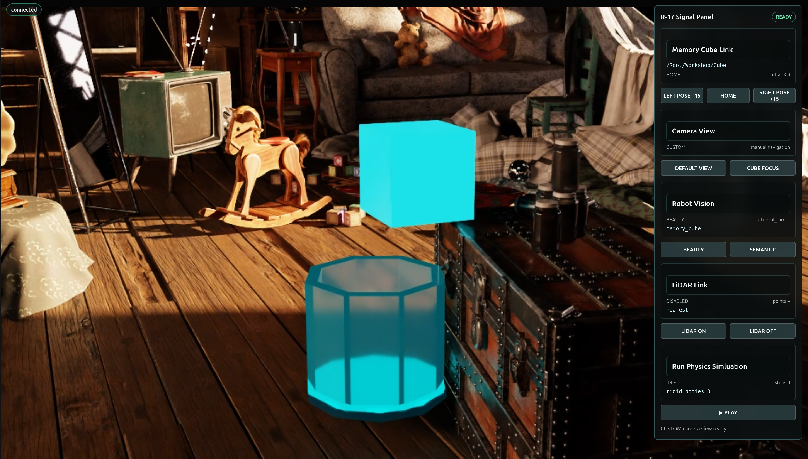

# Inspect What the Scene Is Missing[#](#inspect-what-the-scene-is-missing "Link to this heading")

**Mission connection:** The first drop test produced a symptom and a count, not a complete diagnosis. Before this scene can support reliable training or testing, the team needs a structured report that ties each intended object to a precise, inspectable simulation-readiness requirement. Your asset-publishing and scene-QA experience transfers directly: replace “physics is broken” with a named target, versioned requirement, authored location, and reproducible finding.

## What Changes in the Application[#](#what-changes-in-the-application "Link to this heading")

Mission 2 adds a *Simulation Readiness* section to the existing *Signal Panel*. It includes:

- **RUN SIMREADY VALIDATION**;
- *target name or prim path*;
- *Profile and version*;
- *validation status*;
- *Requirement ID*;
- *severity*;
- *authored prim or property location*; and
- *concise finding text*.

The panel may summarize several targeted asset validations, but the server retains the structured report as the source of truth.

## Decide Before You Build[#](#decide-before-you-build "Link to this heading")

**Your call — what makes a finding actionable?** A report that only says *“physics is broken”* cannot drive a repair. Before you build the validation workflow, decide which target(s) are worth validating and what a finding must name before you would route a fix to it.

**Author your brief.** The tested mission owns the read-only validation architecture. Stepping up from the last mission, author both the **Context** and **Done when** lines yourself. A worked example you can adapt:

```
Context (your addition): Validate the C-9 containment pod and the Mission 2 stage; treat a
finding as actionable only if it names a Requirement ID and the
authored location, not just a symptom.
Done when (your addition): the report lists a target, Profile and version, Requirement ID,
severity, authored location, and a concise finding I can act on.
```

Carry those decisions into the Prompt Builder below, then judge the report against them.

## Mission Brief 2 — Add the Read-Only SimReady Validation Workflow[#](#mission-brief-2-add-the-read-only-simready-validation-workflow "Link to this heading")

Tip

**Make It Yours:** Open the [Prompt Builder](../prompt-builder.html), choose the **SimReady or Not, Here Comes Gravity** session, and select **Mission 2 - Add Read-Only SimReady Validation**. Review your Expert Brief in Context and Done when before you run the mission. If you get stuck, use the provided default to check your work.

Show a finished prompt

```
Goal: Extend the prepared Session 2 Attic Portal with a read-only SimReady validation workflow. Add a panel section titled exactly "SimReady Validate" with a button labeled exactly "run targets". Keep validation IDLE until the user clicks that button; after the click, validate the Mission 2 stage and containment-pod target and report the missing requirements in the panel.
Skills: Read ~/SimReadyPhysics/skills/omniverse-realtime-viewer/SKILL.md and its focused guidance at references/streaming-messages/README.md, references/viewer-control-patterns/README.md, references/viewer-feedback-status/README.md, and references/validation.md. Read ~/SimReadyPhysics/skills/omniverse-cad-to-simready/references/simready-validate/README.md for the validator contract.
Context: Session 2 PreWork and Mission 1 are complete, including the dependency-only Mission 2 preflight at ~/SimReadyPhysics/.preflight/mission\_2.env. Reuse ~/SimReadyPhysics/Attic\_Portal\_Mission\_2 and run ~/SimReadyPhysics/scripts/apply\_and\_verify\_simready\_validate.sh. This default workflow installs, builds, restarts, and performs an idle-only browser smoke test; it must not execute either validation target. Preserve the r17 command/state protocol, renderer-owner queue, and explicit userInitiated guard. Do not rerun PreWork or checkpoint\_00, edit either USD, create scene backups, invoke the validator with a target path during implementation, or set RUN\_SIMREADY\_TARGETS\_FOR\_TEST=1. Keep the full task under five minutes.
Done when: The frontend builds; the panel visibly contains "SimReady Validate" and "run targets"; state.json reports simready.status="IDLE", missingCount=0, targets=[], the Mission 2 stage path, and renderer\_owner\_count=1; the idle browser smoke test reports targetsExecuted=false and captures r17-simready-idle.png; no simready.validateTargets command appears during the apply run; both USD SHA-256 values match the preflight manifest; and the app is left open for the user to click "run targets" manually.
```

After the workflow applies, click **run targets** yourself to produce the report. The default apply run leaves validation `IDLE` on purpose so the finding is user-initiated evidence, not a side effect of the build.



## Validate: Readiness Report Produced[#](#validate-readiness-report-produced "Link to this heading")

Before you move on, confirm you can answer:

- Did the panel stay `IDLE` until you clicked **run targets**?
- Does the report name a *target*, *Profile and version*, *Requirement ID*, *severity*, *authored location*, and *finding*?
- Is there still exactly one renderer owner?

### When a Run Doesn’t Match[#](#when-a-run-doesn-t-match "Link to this heading")

If a check fails, find the first boundary to inspect:

| Symptom | First boundary |
| --- | --- |
| Validation runs during the build instead of staying IDLE | the apply run executed a target - it must leave `simready.status="IDLE"` until you click **run targets** |
| No **run targets** button appears | frontend did not build or restart - rerun the apply and reload |
| The report has no Requirement ID or authored location | the validator ran without a target - click **run targets** yourself after the build completes |

With a named requirement in hand, we’ll route the repair in [Apply the Simulation-Ready Corrections](apply-simready-corrections.html).

On this page
