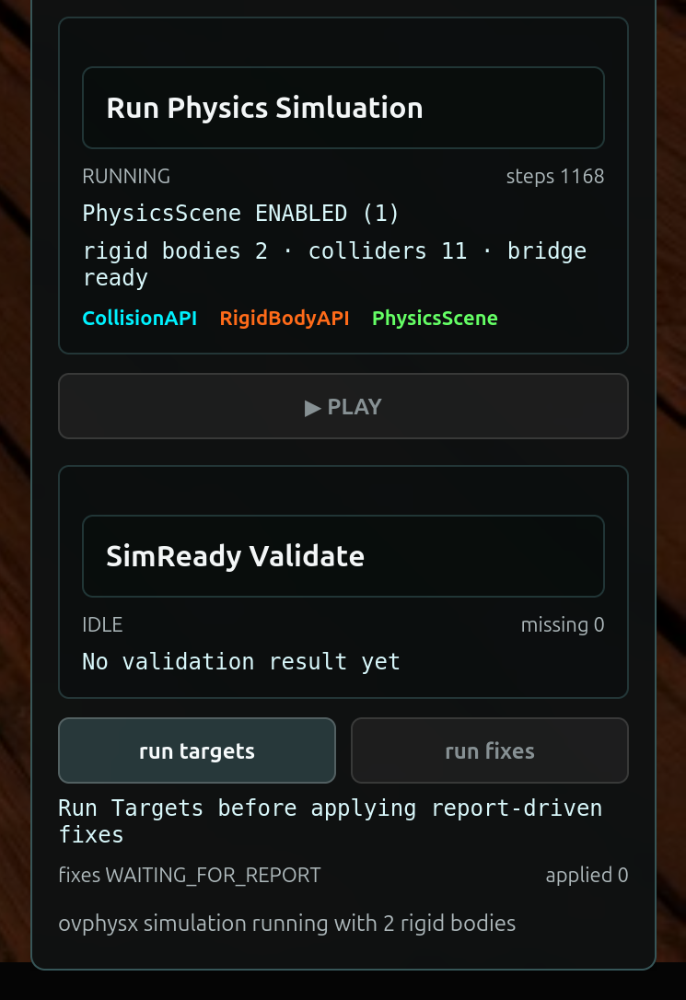

# Prove the Physical Rehearsal[#](#prove-the-physical-rehearsal "Link to this heading")

**Mission connection:** Static validation establishes that the selected assets satisfy their declared contracts. The scene is not ready for deployment until runtime evidence also shows that those assets interact correctly when composed into the full rehearsal. Your animation and FX dailies instincts transfer directly: hold inputs constant, compare runs, inspect motion, contact, and settling, and require telemetry and a persistent report alongside the rendered frame.

## Second Drop Test: Give the World Its Rules[#](#second-drop-test-give-the-world-its-rules "Link to this heading")

You repaired the missing SimReady requirements. The corrected asset outputs now contribute prims with rigid-body and collider schemas:

- A **rigid body** identifies a prim that can participate in simulated motion.
- A **collider** defines the surface the solver can contact.
- A `PhysicsScene` defines the shared physical environment those bodies inhabit.

The last piece is still missing. The attic does not yet contain an explicitly authored `PhysicsScene`.

A `PhysicsScene` is an OpenUSD prim that records scene-wide simulation rules, including the direction and strength of gravity. Without it, the individual assets may be valid, but the composed rehearsal has no explicit, reviewable contract for the world they are expected to behave within. Relying on unstated runtime defaults would make the result difficult to reproduce or trust.

In this mission, you’ll compose the corrected assets into a new, nondestructive physics stage and author its `PhysicsScene` in a deployment-owned layer. You’ll then repeat the drop test while preserving the same starting pose, pod placement, timestep, and duration. By changing only the missing scene-level physics contract, you can connect any new behavior to that authored change.

When you press **Play**, `ovphysx` advances the simulation using the `PhysicsScene` and the physical properties authored on the prims. `ovrtx` renders each resulting scene state, while `ovstream` returns the video and authoritative telemetry to the browser.

A convincing fall is not enough. The evidence must show that the Memory Cube:

- moves under the authored gravity;
- passes through C-9’s open top;
- contacts its physical floor and walls;
- settles inside the acceptance region;
- produces advancing time, step, and pose telemetry; and
- can repeat the result from the same inputs.

This is where your 3D expertise matters. Stage scale, up axis, coordinate frames, collision boundaries, object placement, and layer ownership determine whether the simulation represents the intended physical world. The agent can author the requested `PhysicsScene`, but you define what a coherent and trustworthy world should mean.

## Decide Before You Build[#](#decide-before-you-build "Link to this heading")

**Your call — what makes the composed world trustworthy?** A convincing fall is not evidence. Before you build the physics stage, decide the scene-level contract that makes the rehearsal reproducible (gravity, up axis, scale) and the runtime evidence beyond the visual you require.

**Author your brief.** This is the last guided brief before your open build, so you own the most here: sanity-check the **Skills** route and author both **Context** and **Done when**. A worked example you can adapt:

```
Skills (your check): confirm the brief points the agent at the ovphysx basic-workflow
and prim-transform-safety references before it authors the scene.
Context (your addition): Z-up, centimeter metrics, one enabled PhysicsScene with gravity;
the pod stays open-top with at least 32 units of opening radius.
Done when (your addition): on my Play click the cube passes through the open top, contacts
the floor and walls, settles in the acceptance region, and the run
is reproducible with a persistent OVD report.
```

Carry those decisions into the Prompt Builder below, then judge the runtime evidence against them.

## Mission Brief 4 — Compose the Physics Stage and Author the PhysicsScene[#](#mission-brief-4-compose-the-physics-stage-and-author-the-physicsscene "Link to this heading")

Tip

**Make It Yours:** Open the [Prompt Builder](../prompt-builder.html), choose the **SimReady or Not, Here Comes Gravity** session, and select **Mission 4 - Build the Physics-Ready Stage**. Review your Expert Brief in Context and Done when before you run the mission. Goal and Skills remain tested.

Show a finished prompt

```
Goal: Complete Mission 4 by making the prepared Attic Portal visibly physics-ready and user-controlled. Build the clean physical-stage composite with a valid Xform root, Z-up centimeter metrics, an enabled PhysicsScene with gravity, a dynamic Memory Cube, the repaired open-top containment-pod colliders with no top, lid, ceiling, or cap collider and at least 32 units of opening radius, a stationary kinematic pod, and a static ground collider. Show distinct viewport outlines for RigidBodyAPI, CollisionAPI, and PhysicsScene. Wire Play for continuous fixed-step ovphysx simulation and renderer-owner RIGID\_BODY\_POSE handoff, but do not start or step physics during implementation or automated verification. The cube must fall only when the user later clicks Play.
Skills: Read ~/SimReadyPhysics/skills/omniverse-realtime-viewer/SKILL.md, references/viewport-overlays/README.md, references/viewer-feedback-status/README.md, references/prim-transform-safety/README.md, and references/validation.md. Read the installed ovphysx 0.4 guidance at ~/evidence-lab-ovrtx-minimal/.venv/lib/python3.12/site-packages/ovphysx/skills/basic-workflow/SKILL.md and skills/tensor-bindings-cpu/SKILL.md. On a later user Play click, load the stage, wait for completion, create persistent pose bindings once, step at a fixed 1/60 second, read poses, reuse the bindings, and release them cleanly.
Context: Session 2 PreWork and Missions 1–3 are complete, including the dependency-only Mission 4 preflight at ~/SimReadyPhysics/.preflight/mission\_4.env. Reuse ~/SimReadyPhysics/Attic\_Portal\_Mission\_4 and run ~/SimReadyPhysics/scripts/apply\_and\_verify\_mission4.sh. Build from ~/SimReadyPhysics/OldAttic\_Mission\_3\_Fixed.usda into ~/SimReadyPhysics/OldAttic\_Mission\_4\_Physics.usda using the dedicated Mission4\_PhysicsLayer.usda and sanitized Mission4\_AuthoredScene.usda outputs. Preserve all source scenes and do not create backup scenes. Keep the full camera, robot-vision, Lidar, SimReady panel, r17 command/state protocol, and one renderer owner. Physics owns the Memory Cube transform while running, so manual cube-pose commands must not compete with it. Automated verification must not click Play, send physics.play, create pose bindings, step ovphysx, or run a drop test. Keep the workflow under five minutes.
Done when: The frontend builds; the physical-stage contract reports rootType="Xform", upAxis="Z", metersPerUnit=0.01, one PhysicsScene, two rigid bodies, eleven collision APIs, cubeDynamic=true, podKinematic=true, podOpenTop=true, and podMinimumOpeningRadius>=32; the viewport and panel visibly identify RigidBodyAPI, CollisionAPI, and PhysicsScene; the panel reports PhysicsScene ENABLED and the Play button is enabled; final state.json reports the Mission 4 stage, status="READY\_TO\_RUN", playing=false, stepCount=0, elapsedTime=0, sceneEnabled=true, sceneCount=1, rigidBodyCount=2, colliderCount=11, visualizationVisible=true, bridgeReady=false, and renderer\_owner\_count=1. No physics.play command appears in the apply-run log, mission4-physics-ready.json reports dropTestExecuted=false, all source hashes remain unchanged, no recurring backup files are created, and the app is left open for the user to click Play manually.
```

Tip

**Predict first:** Before you press **Play**, predict what the cube will do - whether it passes through C-9’s open top, contacts the floor and walls, and settles inside the acceptance region - and the telemetry you expect to see. Then compare against the runtime evidence.

After the workflow leaves the app `READY_TO_RUN`, press **Play** yourself to run the drop test and produce runtime evidence.

[Your browser does not support the video tag.](../_images/lab-2-collider-overlay.webm)

## Runtime Evidence[#](#runtime-evidence "Link to this heading")

The *Physics Rehearsal* section reports:

- nonzero rigid-body count;
- simulation time and step count;
- finite cube pose;
- contact state or count;
- containment result;
- `PASS` or `ERROR` status; and
- a path or link to the **OVD report**.

The OVD report is the persistent proof that lives beside the rendered frame. A convincing picture is not evidence; the telemetry and report are what a robotics team can review and reproduce.



## Validate: Runtime Proof Captured[#](#validate-runtime-proof-captured "Link to this heading")

Before you move on, confirm you can answer:

- Does the scene report one `PhysicsScene`, two rigid bodies, and the expected collider count with the pod open at the top?
- When you press **Play**, does the cube fall under gravity, pass through the open top, contact the floor and walls, and settle inside the acceptance region?
- Does the panel produce advancing time, step, and pose telemetry plus a linked OVD report?
- Can you repeat the result from the same inputs?

### When a Run Doesn’t Match[#](#when-a-run-doesn-t-match "Link to this heading")

If a check fails, find the first boundary to inspect:

| Symptom | First boundary |
| --- | --- |
| The cube falls during the build or automated verification | physics ran too early - the cube must fall only on your Play click |
| Play is disabled or `sceneEnabled=false` | no `PhysicsScene` was authored or enabled - confirm one enabled `PhysicsScene` with gravity |
| The cube falls but never contacts the pod floor | scale, up-axis, or collider mismatch - confirm Z-up, centimeter metrics, and the open-top colliders |

With runtime proof captured, we’ll interact with the live world and package the workflow in [Pick Up the Physical World](pick-and-package.html).

On this page
