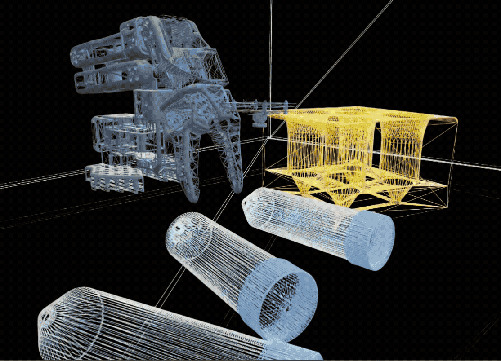

# Overview[#](#overview "Link to this heading")

This learning path will teach you how to train and deploy a physical AI model to a physical robot, starting in simulation then moving to the real world.

Teleoperation example in simulation.

Autonomous execution based on model trained with teleoperation data.

## What Is Physical AI?[#](#what-is-physical-ai "Link to this heading")

Physical AI refers to AI systems that interact with and manipulate the physical world. Unlike generative or agentic AI (think image generators, chatbots), Physical AI has the ability to:

- **Perceive** the real world through sensors
- **Reason** about physics, objects, and spatial relationships
- **Act** through motors, actuators, and end-effectors
- **Adapt** to the unpredictability of real environments

This learning path teaches a complete Physical AI workflow with physical robots, from simulation to a robot acting autonomously, right in front of you.

## The Task: Centrifuge Vial Pick-and-Place[#](#the-task-centrifuge-vial-pick-and-place "Link to this heading")

Vial to rack pick-and-place task performed autonomously by an SO-101 robot.[#](#id1 "Link to this image")

The task we’ll use today is **unstructured pick-and-place of centrifuge vials**. The vials are scattered on a table and need to be placed into a designated rack.

We’ve simplified some of the constraints with a lightbox, and with some of the parameters of the task, to make it more approachable.

But **the tools and techniques you’ll learn are applicable to more complex tasks** and production robots. The focus of this learning path is the sim-to-real **workflow**.

### Why This Task?[#](#why-this-task "Link to this heading")

So why did we pick this task? Let’s imagine we are engineers solving a laboratory problem.

In our fictional problem, these vials are dropped down a chute or otherwise scattered in an unstructured way, but need to be organized into a rack for processing by automated machinery - a line that already exists.

- **Real-world relevance**: this is an analogy for workflows where items must be prepared for autonomous analysis machines.
- **Safety implications**: think of use cases where potentially hazardous samples are handled, so minimizing human exposure is critical, hence the use of robotics. The ability to teach the task in simulation also saves time and reduces exposure.
- **Technical challenge**: adaptation to change, ability for the robot to adapt and retry.
- **Approachable**: for learning, this task is simple enough to gather objects for and perform teleoperation.

## Why Is This Problem Interesting?[#](#why-is-this-problem-interesting "Link to this heading")

Our policy will work from 2D camera information, and the placement of the vials in the rack requires re-orienting the vials and placing them fairly precisely.

As you’ll likely find from teleoperating the task yourself, it’s not easy at first. One major issue is that the robot’s gripper camera will become occluded after the robot grasps a vial, so the policy will need to be able to operate without this information.

You’ll experience this challenge first-hand when you do teleoperation yourself.

Note

The SO-101 isn’t a production robot, but it’s a fun, approachable platform for learning these tools before you apply them to production robots. Again, the focus here is a **workflow** that you can apply to other tasks, or to production robots.

## Why Simulation Matters[#](#why-simulation-matters "Link to this heading")

Task wireframe: vials are scattered on a table, to be placed into a rack by the robot.[#](#id2 "Link to this image")

Testing robots in the real world is expensive, risky, and sometimes dangerous.

Simulation addresses these fundamental limitations:

1. **Time**: Real-world data collection is slow—one trajectory takes the same time whether you have one robot or one thousand
2. **Cost**: Robot hardware is expensive, and failures during exploration can cause damage
3. **Safety**: Exploring failure modes on real hardware can be dangerous
4. **Diversity**: Creating varied training scenarios (different lighting, objects, positions) is labor-intensive

Simulation addresses all of these:

| Challenge | Real World | Simulation |
| --- | --- | --- |
| Training speed | 1x real-time | 1000x+ parallel environments |
| Hardware cost | $10K-$100K+ per robot | Marginal compute cost |
| Failure consequence | Damage, downtime | Reset and continue |
| Scenario diversity | Manual setup | Procedural generation |

### Privileged Information[#](#privileged-information "Link to this heading")

Simulation also provides access to information that might be impossible to obtain in the real world:

- **Exact object poses**: No perception noise or occlusion
- **Contact forces**: Precise measurements at every contact point
- **Ground truth labels**: Perfect segmentation and object identity
- **State derivatives**: Exact velocities and accelerations

This privileged information can accelerate learning, even when the final policy only uses realistic sensor inputs.

## Key Takeaways[#](#key-takeaways "Link to this heading")

- Simulation enables fast, safe, diverse training that can be impossible in the real world
- The sim-to-real gap is a fundamental challenge that requires systematic approaches
- This learning path provides hands-on experience with NVIDIA Isaac and multiple gap-closing strategies
- Success comes from iteration and combining approaches

Using a VLA (Vision Language Action) model called Isaac GR00T, our system will receive a language command like “pick up the vial and place it on the rack”, and use joint feedback and camera observations as policy inputs. The policy then outputs motor positions to execute the task.

## What’s Next?[#](#what-s-next "Link to this heading")

This learning path has some flexibility built-in to match your goals and time constraints. Let’s cover those options next!

Continue to [How to Take This Course](02-how-to-take-this-course.html).

On this page
