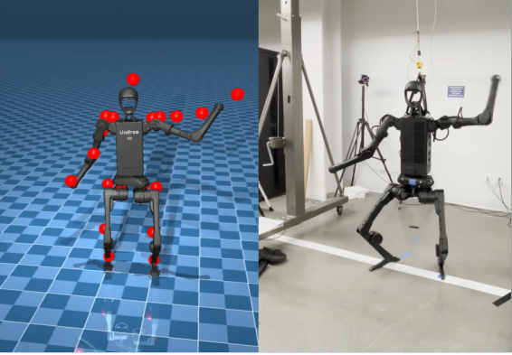

# What Is Sim-to-Real?[#](#what-is-sim-to-real "Link to this heading")

What Do I Need for This Module?

Nothing — this module is theory-only.

## Learning Objectives[#](#learning-objectives "Link to this heading")

By the end of this session, you’ll be able to:

- **Define** sim-to-real transfer and its goals
- **Identify** the four major categories of sim-to-real gaps
- **Explain** why transfer is difficult even with high-fidelity simulation

## Sim-to-Real Defined[#](#sim-to-real-defined "Link to this heading")

**Sim-to-real** refers to the process of training a policy in simulation and deploying it on real hardware. The goal is a policy that performs well in the real world despite being trained entirely (or primarily) in simulation.

Sim-to-Real with Unitree H1[#](#id1 "Link to this image")

## The Sim-to-Real Gap[#](#the-sim-to-real-gap "Link to this heading")

The **sim-to-real gap** is the performance difference between simulation and reality. A policy achieving high success rates in simulation may perform significantly worse on real hardware.

Warning

The sim-to-real gap is often larger than expected. And while colloquially we may discuss “the gap” as if it’s a single entity, the gap is a complex combination of gaps in sensing, actuation, physics, and modeling.

Never assume a policy will “just work” on real hardware without systematic testing and iteration.

## Sources of the Gap[#](#sources-of-the-gap "Link to this heading")

### Sensing Gaps[#](#sensing-gaps "Link to this heading")

- Camera models lack real sensor noise, blur, and distortion
- Depth sensors have idealized measurements without artifacts
- Simulated lighting differs from real lighting conditions

### Actuation Gaps[#](#actuation-gaps "Link to this heading")

- Motor models lack friction, backlash, and thermal effects
- Joint dynamics are simplified
- Control loop timing differs between simulation and hardware

### Physics Gaps[#](#physics-gaps "Link to this heading")

- Contact dynamics (friction, restitution) are approximations
- Deformable objects are difficult to simulate accurately
- Fluid dynamics and granular materials are computationally expensive

### Modeling Gaps[#](#modeling-gaps "Link to this heading")

- CAD models differ from as-built hardware
- Mass and inertia properties are estimates

## What Makes Transfer Hard?[#](#what-makes-transfer-hard "Link to this heading")

The sim-to-real gap isn’t just about simulation fidelity. Even with perfect simulation, transfer is challenging because:

1. **Distribution shift**: Real-world conditions vary from training
2. **Compounding errors**: Small perception errors lead to large action errors
3. **Unmodeled dynamics**: Real physics has effects that may not be represented in simulation
4. **Temporal differences**: Real-time constraints affect behavior

## Summary[#](#summary "Link to this heading")

| Gap Category | Examples |
| --- | --- |
| Sensing | Camera noise, lighting, depth artifacts |
| Actuation | Friction, backlash, thermal effects |
| Physics | Contact dynamics, deformables |
| Modeling | CAD errors, mass/inertia estimates |

Understanding these gaps is essential—throughout this learning path, you’ll learn strategies to address each category.

## What’s Next?[#](#what-s-next "Link to this heading")

Now that you understand the sim-to-real challenge, let’s learn about the tools we’ll use. In the next session, [LeRobot: Background and Community](04-lerobot.html), you’ll learn about the Hugging Face ecosystem for robotics.

On this page
