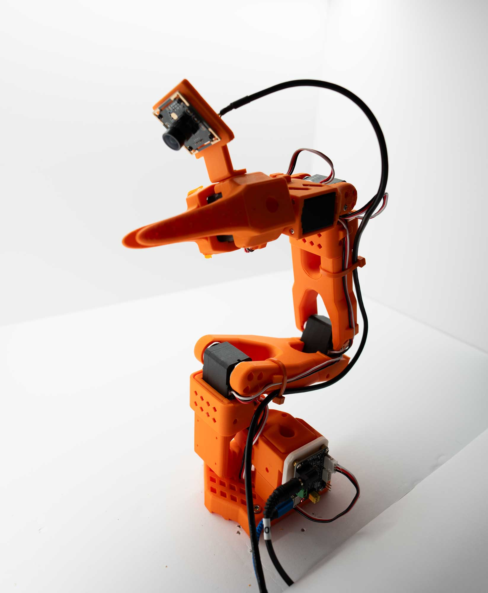
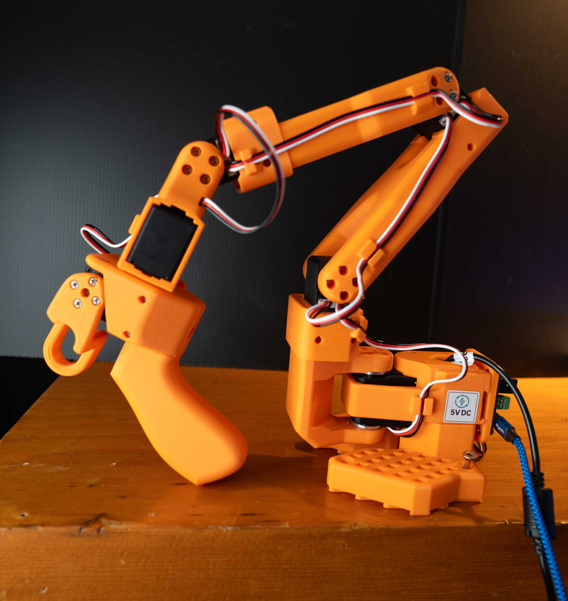

# LeRobot: Background and Community[#](#lerobot-background-and-community "Link to this heading")

What Do I Need for This Module?

Nothing — this module is theory-only.

In this session, we’ll explore the background of the SO-101 robot in front of you, the Hugging Face LeRobot project, and the community resources available to support your work.

This framework is an approachable way to learn robotics, and become familiar with the same practices used on industrial robots, in an affordable way you can even try yourself at home.

## Learning Objectives[#](#learning-objectives "Link to this heading")

By the end of this session, you’ll be able to:

- **Describe** the SO-101 robot and its capabilities
- **Explain** the LeRobot project and its role in the robotics community
- **Identify** community resources for continued learning

## The SO-101 Robot[#](#the-so-101-robot "Link to this heading")

The SO-101 is a 6-DOF (degrees of freedom) robot arm designed for research and education in manipulation tasks.

While we colloquially refer to the SO-101 as a single robot, it’s typically sold or made as a pair:

- **Teleop arm** (also called the “leader”): You move this arm by hand to perform demonstrations. The encoder positions can be recorded or used to directly manipulate the robot arm, or both.
- **Robot arm** (also called the “follower”): During teleoperation it mirrors the teleop arm; during evaluation it is driven by a policy.

[](_images/SO101_follower.jpg)

SO-101 Robot, also known as the “follower arm”.[#](#id1 "Link to this image")

The typical kit also includes a teleoperation arm, which is used to control either simulated robots or the “follower” arm.

[](_images/SO101_leader.jpg)

SO-101 Teleoperation Arm, also known as the “leader arm” or “teleop arm”. Notice the gripper on the end of the arm for your hand to manipulate the robot.[#](#id2 "Link to this image")

### Joint Configuration[#](#joint-configuration "Link to this heading")

The SO-101 has six joints:

1. **Base** (J1): Rotation around vertical axis
2. **Shoulder** (J2): First arm segment elevation
3. **Elbow** (J3): Second arm segment elevation
4. **Wrist Pitch** (J4): Wrist up/down rotation
5. **Wrist Roll** (J5): Wrist rotation around arm axis
6. **Gripper** (J6): Parallel jaw gripper

### Why SO-101?[#](#why-so-101 "Link to this heading")

The SO-101 is ideal for this learning path because:

- **Accessible**: Affordable for education and research
- **Well-documented**: Strong community support
- **LeRobot integration**: First-class support in the LeRobot ecosystem
- **Sim-ready**: Accurate simulation models available

## The LeRobot Project[#](#the-lerobot-project "Link to this heading")

LeRobot is an open-source library from Hugging Face which includes tools for data collection, training, robot control, and evaluation of robot policies.

### Community Datasets[#](#community-datasets "Link to this heading")

LeRobot hosts community-contributed datasets on the Hugging Face Hub with the LeRobot Dataset Format.

- Thousands of robot demonstrations
- Multiple robot platforms
- Various manipulation tasks
- Standardized formats for interoperability

## Why LeRobot for This Course[#](#why-lerobot-for-this-course "Link to this heading")

LeRobot is the foundation of this course for several practical reasons:

### Seamless Data Flow With Hugging Face Hub[#](#seamless-data-flow-with-hugging-face-hub "Link to this heading")

Getting data into and out of the system is straightforward:

```
# Example command
# Push your collected dataset to the Hub
hf upload ${HF\_USER}/my\_robot\_dataset ./datasets/my\_robot\_dataset
# Pull datasets for training or co-training
hf download lerobot/community\_dataset
```

This Hub integration means you can share datasets with collaborators, version your data, and access community contributions with minimal friction.

### Post-Training Pipeline[#](#post-training-pipeline "Link to this heading")

LeRobot wraps established training pipelines (including NVIDIA Isaac GR00T, SmolVLA, and more):

```
# Example command
# Fine-tune a policy on your data
python lerobot/scripts/train.py \
--policy.type=gr00t \
--dataset.repo\_id=${HF\_USER}/my\_dataset
```

You spend time on your task, not on infrastructure.

### Real Robot Evaluation[#](#real-robot-evaluation "Link to this heading")

The same framework used for data collection handles policy deployment:

```
# Example command
# Evaluate a trained policy on the real robot
lerobot-eval \
--robot.type=so101\_follower \
--robot.port=$ROBOT\_PORT \
--policy\_path ${HF\_USER}/my\_trained\_policy
```

This closes the loop: collect data → train → deploy → evaluate → iterate. All within one system.

## Community Resources[#](#community-resources "Link to this heading")

### Dataset Visualizer[#](#dataset-visualizer "Link to this heading")

LeRobot provides an interactive dataset visualizer on Hugging Face Spaces:

- [LeRobot Dataset Visualizer](https://huggingface.co/spaces/lerobot/visualize_dataset)

Use this tool to explore any LeRobot dataset on the Hub. You can scrub through episodes, view camera feeds, and inspect action/state trajectories—useful for debugging data quality issues or understanding what a dataset contains before training.

### Documentation[#](#documentation "Link to this heading")

- [LeRobot Documentation](https://huggingface.co/docs/lerobot)
- [SO-101 Getting Started Guide](https://huggingface.co/docs/lerobot/en/so101)

### Examples and Tutorials[#](#examples-and-tutorials "Link to this heading")

- [GR00T N1.5 SO-101 Tuning](https://huggingface.co/blog/nvidia/gr00t-n1-5-so101-tuning)
- Community notebooks and examples

### Community Channels[#](#community-channels "Link to this heading")

- Hugging Face Discord
- GitHub Discussions
- Community forums

## Hugging Face Hub Integration[#](#hugging-face-hub-integration "Link to this heading")

LeRobot leverages the Hugging Face Hub for:

### Dataset Sharing[#](#dataset-sharing "Link to this heading")

```
# Example command
# Download a community dataset
hf download lerobot/so101\_pickplace
```

### Model Sharing[#](#model-sharing "Link to this heading")

```
# Example command
# Download a pre-trained model
hf download lerobot/groot\_so101\_vial\_pickup
```

### Experiment Tracking[#](#experiment-tracking "Link to this heading")

Integration with Weights & Biases and other experiment tracking tools.

### How We Used Hugging Face in This Course[#](#how-we-used-hugging-face-in-this-course "Link to this heading")

**1. Dataset format for gathering demonstrations**

We used the LeRobot dataset format for all teleoperation data. Episodes are stored with observations (e.g. camera images), robot state, and actions in a consistent schema. Recording is done with `lerobot_agent` (or `lerobot_record` on real hardware) using `--repo_id` and `--repo_root` so that data lands in the correct structure for training and for upload to the Hub.

**2. Sharing datasets**

Datasets were pushed to the Hugging Face Hub so they could be reused for training, shared with others, and versioned. We used `--dataset.repo_id=${HF_USER}/dataset_name` and `--dataset.push_to_hub=true` when recording, or `hf upload` for existing local datasets. The [LeRobot Dataset Visualizer](https://huggingface.co/spaces/lerobot/visualize_dataset) on the Hub was used to inspect episodes and verify quality before training.

**3. Merging datasets for co-training (sim + real, sim + Cosmos)**

For co-training we combined multiple data sources into a single training dataset. Sim + real: we merged simulation teleop datasets with real-robot teleop datasets (e.g. `so101_teleop_vials_rack_left` with `so101_teleop_vials_rack_left_real_50`) so the policy could learn from both. Sim + Cosmos: we combined base sim data with Cosmos-augmented synthetic data. Merging was done via the Hub (download multiple repos, merge locally) or by pointing the training script at a single merged repo so that one run could use sim, real, and augmented data together.

**4. Sharing evaluations**

Evaluation results and policy checkpoints were shared via the Hub. Trained models were uploaded (e.g. as GR00T checkpoints or LeRobot policy repos) so others could reproduce evaluations or run the same policy in sim and on the real robot. Links to specific datasets and model repos were used in this learning path to align everyone on the same baselines and co-trained models.

## Key Takeaways[#](#key-takeaways "Link to this heading")

- SO-101 is an accessible, well-supported robot for learning sim-to-real
- LeRobot provides open-source tools, datasets, and models
- The Hugging Face community offers ongoing support and resources
- You’re joining a growing community of robot learners and practitioners

## What’s Next?[#](#what-s-next "Link to this heading")

Next, [Building the Workspace](05-building-workspace.html) walks through assembling and lighting the physical lightbox and task props. After that, [Calibrating the SO-101](07-calibrating-so101.html) covers power-on and calibration, and [Operating the SO-101](08-operating-so101.html) covers teleoperation and camera setup.

On this page
