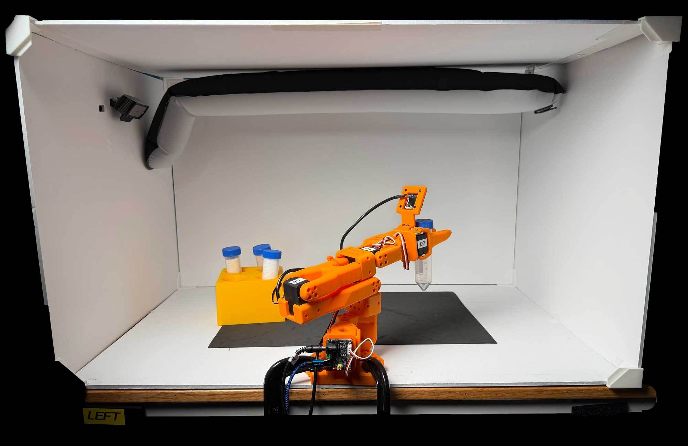
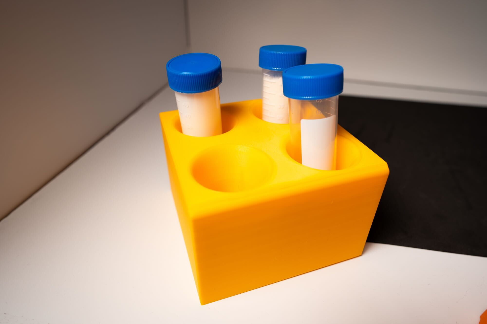
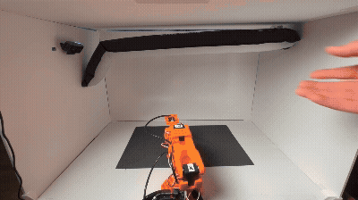

# Building the Workspace[#](#building-the-workspace "Link to this heading")

What Do I Need for This Module?

The equipment is listed below - here you will assemble your robot laboratory.

This module is about **constructing and standardizing the real-world task area**. This includes a lightbox enclosure, lighting, cameras, mat, vials, and rack—so it matches the Isaac Lab scene used for training and evaluation.

Building the lightbox this way gives you a consistent environment, so you can use our models and datasets.

You can also keep using it after this learning path, to do more of your own robot experiments!

## Video Tutorial[#](#video-tutorial "Link to this heading")

Important

Why are we starting with the physical workspace?

When you do Physical AI work in the real world, you might not have a **physical** workspace available to you when you start out. We often start in sim, for all the reasons we discussed earlier (ease of testing, cost, safety, ease of iteration).

For this workshop, we will set up the physical space first for three reasons:

1. We give you this info early on, so you can order parts or build your workspace in prep for finishing the learning path
2. To give you experience with the physical robot and teleoperation. It’s fun!
3. To give you a sense of how “hard” the task is, when using the same inputs the AI model will have (two cameras, joint positions)

## The Lightbox Environment[#](#the-lightbox-environment "Link to this heading")

Let’s start by building a **white lightbox enclosure** that includes:

1. **Cameras** — one on the robot (wrist / gripper view), one stationary (external / scene view)
2. **Lights** — diffuse light with controllable brightness
3. **Props** — centrifuge vials, yellow rack, foam mat.

Why we use a lightbox

**Limits variables for learning and debugging**
A plain, bright enclosure reduces visual noise so the policy can focus on the task-relevant features—gripper, vials, and rack.

**Matches the digital twin**
The Isaac Lab scene replicates this enclosure’s dimensions, color, camera placements, and object geometry. Matching the real bench to that design shrinks the visual domain gap—one of the main sources of sim-to-real failure.

**Accommodates low-performance cameras**
Consumer webcams have auto-exposure and limited dynamic range. Bright, diffuse lighting inside the box keeps images clean and consistent.

**Enables transferable models**
Controlling the environment makes it easier to prepare models that transfer across robots and setups. Debugging focuses on policy and calibration, not uncontrolled scene drift.

## Bill of Materials[#](#bill-of-materials "Link to this heading")

The complete robot + workspace setup should cost less than $500 USD, estimated based on the options below.

We recommend getting the SO-101 pre-assembled, as it comes with a teleop arm and is easier to assemble. You can also build it yourself, but it’s a bit more work.

### Robot[#](#robot "Link to this heading")

Approximate cost: $300 USD

| Item | Description | Model/Specs | Quantity | Details |
| --- | --- | --- | --- | --- |
| **SO-101 Robot Arm and Teleop Arm** | 6-DoF collaborative robot arm (SO-101 or similar) | [SO-101](https://shop.wowrobo.com/products/so-arm101-diy-kit-assembled-version-1?variant=46588641706201) package 3, orange | 1 | Main robot for pick-and-place task; Teleop arm optional for demonstration recording. We recommend this kit because of the included gripper camera, which will match our datasets. Alternatively, you can [print and build your own SO-101](https://github.com/TheRobotStudio/SO-ARM100)! |

### Workspace[#](#workspace "Link to this heading")

Approximate cost: $130 USD

| Item | Description | Model/Specs | Quantity | Details |
| --- | --- | --- | --- | --- |
| **Camera (External)** | USB webcam, fixed mount, ~78° horizontal FoV | [Logitech C920](https://www.amazon.com/Logitech-C920x-Pro-HD-Webcam/dp/B085TFF7M1) or equivalent | 1 | Fixed perspective to capture overview of workspace; must be stable and aligned as in simulation. |
| **Lightbox Enclosure Panels** | White foam board box, approx. 30” wide, 20” tall, 20” deep. | Assemble from 5 sheets of [20x30” foam board, 3/16” thick](https://www.michaels.com/product/20-x-30-white-foam-board-10110205) | 5 | Provides consistent, diffuse lighting and neutral background for images. Other white lightboxes can be substituted. Thicker or thinner foam board works. |
| **Light Source** | LED tube light, diffuse, CRI >90, ~4000K, adjustable | [Neewer Dimmable LED Bar](https://www.amazon.com/NEEWER-Inflatable-2700K-5600K-Photography-GC10B/dp/B0DQ7Y8DWX?th=1) | 1 | Ensures workspace is brightly and uniformly illuminated. |
| **Black Work Mat** | Foam mat for workspace | [Black EVA foam](https://www.michaels.com/product/12-x-18-thick-foam-sheet-by-creatology-10661709) | 1 | Non-slip surface for vials and rack; color matches simulation environment. |
| **Centrifuge Vials** | 50ml with screw cap, clear plastic | [Falcon tube or similar](https://www.amazon.com/Kashi-Scientific-Conical-Centrifuge-Graduation/dp/B0C35JV95M?th=1) | 1-4 | Props manipulated by robot; clear sides allow for visual consistency with simulation. |
| **Vial Rack** | Yellow, fits 4+ vials, similar to simulation asset | 3D printed in yellow - models available [here](https://www.printables.com/model/1675961-vial-rack-50ml-centrifuge) | 1 | Holds vials upright, target for pick and place. Yellow color to match digital twin is best, as low as 5% infill can work. |
| **USB-C Charging Block** | To power the light | [Anker 25W USB-C Charging Block](https://www.amazon.com/gp/product/B0D72DWLZ1/) | as needed | 21W or greater. Sufficient power for all lights and accessories; ensure safety and compliance with device specs. |
| **USB-C Cable** | To power the light | [USB-C to USB-C cable, 6ft](https://www.amazon.com/Anker-Charging-MacBook-Galaxy-Charger/dp/B088NRLMPV) | 1 | Suggested light above is battery powered, but this will keep it powered |
| **(optional) Foam board joints** | To assemble lightbox | 3D printed, model [here](https://www.printables.com/model/1652109-foam-board-joints-for-lightbox) | 8 | Allows assembly of lightbox without tearing the foam board during disassembly. Alternatively, you can use tape. |

### Props[#](#props "Link to this heading")

Approximate cost: $20 USD.

| Item | Description | Model/Specs | Quantity | Details |
| --- | --- | --- | --- | --- |
| **Centrifuge Vials** | 50ml with screw cap, clear plastic | [Falcon tube or similar](https://www.amazon.com/Kashi-Scientific-Conical-Centrifuge-Graduation/dp/B0C35JV95M?th=1) | 1-4 | Props manipulated by robot; clear sides allow for visual consistency with simulation. |
| **Vial Rack** | Yellow, fits 4 vials, same model used to create simulation USD asset | 3D printed, model [here](https://www.printables.com/model/1675961-vial-rack-50ml-centrifuge) | 1 | Holds vials upright; color/shape should closely match digital asset. |

## Build the Workspace[#](#build-the-workspace "Link to this heading")

In short, we’ll:

1. **Cut** the foam board to size
2. **Cut** a hole for the external camera
3. **Mount** the light
4. **Clamp** and **position** the props and robot.

### Assemble the Lightbox[#](#assemble-the-lightbox "Link to this heading")

1. **Cut** 2 of the 5 foam board panels down to 20” x 20” (50.8 cm x 50.8 cm). These will become the sides.
2. On one of the 20” x 20” (50.8 cm x 50.8 cm) panels, **cut** a rectangular hole for the external camera. The Logitech webcam arm is approximately 5 cm × 1.5 cm — size the hole to slide it through snugly.
3. Now **assemble** the box - there are two options:

Option A — Tape (fast)

White duct tape or gaffer tape along the seams.

- **Pros**: cheap, fast, no tools required
- **Cons**: removing the tape later will damage the foam board

Keep foam board edges flush when taping. Running tape along the full length of each seam produces the strongest bond; small pieces work but are weaker.

Option B — 3D-printed corners (reusable)

Print the corner assemblies from the BOM link above and snap panels in.

- **Pros**: clean look, easy to disassemble and reassemble
- **Cons**: requires access to a 3D printer

### Camera Placement Measurements[#](#camera-placement-measurements "Link to this heading")

Camera placement diagram[#](#id1 "Link to this image")

| Parameter | Value |
| --- | --- |
| **Height** | 40 cm from back of lightbox |
| **Distance from back wall** | 27 cm from back of robot to center of camera lens |
| **Angle** | 45 deg downward, aimed at the workspace. Make sure the camera has a good view of both the robot, the vials, and the rack. |

Tip

Verify the camera view matches the sample images before finalizing the slot position. A few centimeters of error is acceptable; large deviations change what the policy sees and degrade performance.

## Set Up the Light[#](#set-up-the-light "Link to this heading")

The light should be **bright, diffuse, and daylight-temperature**. If you use the lights listed in the BOM, they are already diffuse.

Warning

These lights can get warm over extended use. Do not leave them on overnight, and monitor temperature during long sessions.

Foam board top — interior mount

If you use foam board for the top panel, mount a diffuse panel light inside the lightbox facing down. Zip ties through small holes in the foam board are the most reliable attachment; tape can work but may release from heat.

Open top — external mount

Clamp or position an external diffuse light above the open top, angled to illuminate the workspace evenly.

*Turn on the light and set brightness before teleoperation or policy runs.*[#](#id2 "Link to this image")

1. **Press** the **power button** on the light.
2. **Press and hold** the **power button** again until the travel lock progress bar completes and the light stays on.
3. **Use** the **brightness controls**; for evaluations and data collection, target roughly **50–100 %**.
4. **Plug in** the light if AC power is available; battery-only runs may not last a full session.

## Mount the Robot[#](#mount-the-robot "Link to this heading")

Clamp the SO-101 to a solid table. Position it so the base sits inside the lightbox at the position shown in the reference photo below.

This gives it good range-of-motion and lets the external camera see the robot well.

**Verify** the clamps do **not** restrict the robot’s range of motion—test by manually moving each joint through its range before powering on.

## Arrange the Mat, Vials, and Rack[#](#arrange-the-mat-vials-and-rack "Link to this heading")

Our simulation environment and checkpoint models are overfit to the rack generally being on the **left** side and vials on the **right**. Use the reference photo above for positioning.

If you customize the Isaac Lab environment we’ll use later, you could try out other configurations!

### Rack Placement Measurements[#](#rack-placement-measurements "Link to this heading")

Place the foam mat flat under the vials, and scatter 1–3 vials on the mat in varied poses (same general layout as in simulation).

## Physical Layout Checklist[#](#physical-layout-checklist "Link to this heading")

Before you place the robot in the enclosure or run any real-robot software:

1. **Enclosure** — Lightbox panels assembled; interior clear of stray objects.
2. **Mat and props** — Foam mat flat; **yellow rack** in its designated spot; **1–3 vials** on the mat in varied poses (same general layout as in simulation).
3. **Cameras** — Wrist and external cameras mounted and aimed so both the mat/rack and gripper workspace are visible; no heavy occlusion or glare.
4. **Cables** — Route camera and robot cables so they do **not** snag or limit joint motion (cables can create false calibration limits; see [Troubleshooting](troubleshooting.html), *Calibration Fails*).
5. **Lighting** — Light on and bright enough (previous section).

Re-check this checklist **before** [Real Evaluation](12-real-evaluation.html) and before each [Strategy 2](13-strategy2-cotraining.html) / [Strategy 3](14-strategy3-cosmos.html) deployment if anything was moved.

## Key Takeaways[#](#key-takeaways "Link to this heading")

- Workspace setup is critical for successful training and deployment.

## What’s Next?[#](#what-s-next "Link to this heading")

With the workspace built and staged, continue to [Get the Code](06-get-the-code.html).

On this page
