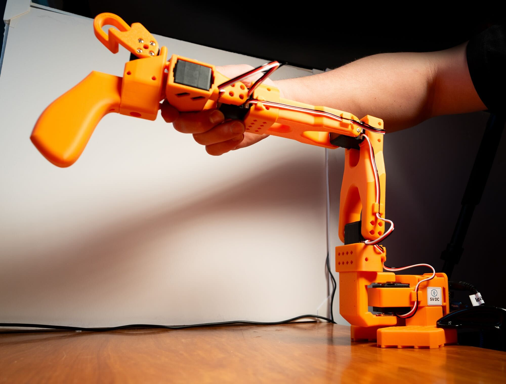
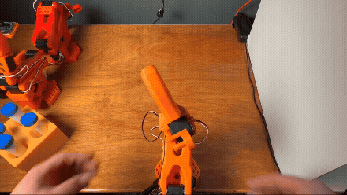
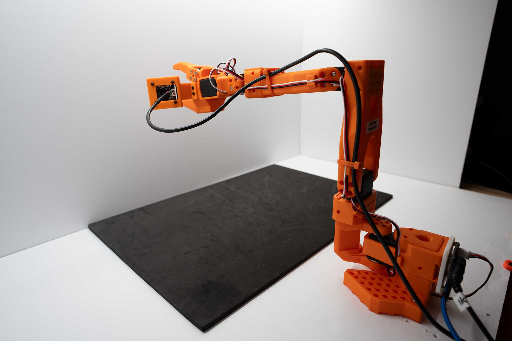
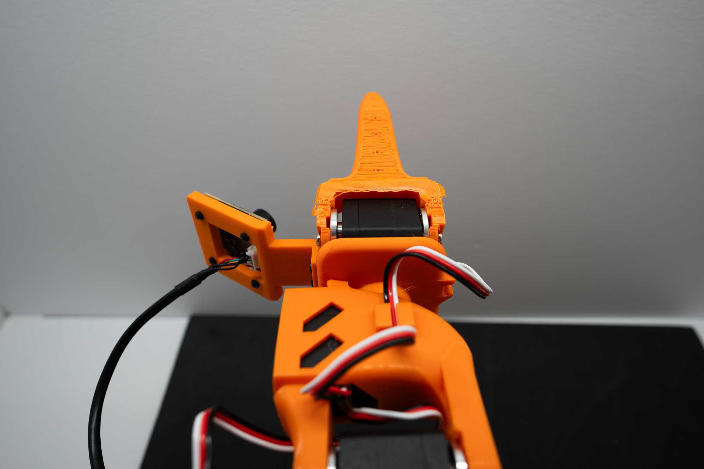

# Calibrating the SO-101[#](#calibrating-the-so-101 "Link to this heading")

What Do I Need for This Module?

Hands-on. You’ll need the physical SO-101 robot, teleop arm, USB cables, and the assembled workspace from [Building the Workspace](05-building-workspace.html).

In this session, you’ll power up the SO-101 robot, run through the calibration process, and verify the calibration is correct.

While calibration can be a bit tedious, it is essential for accurate robot control and for our AI model to perform well.

Tip

If you encounter hardware issues during this session, see the [Troubleshooting Guide](troubleshooting.html) for solutions to common problems.

## Learning Objectives[#](#learning-objectives "Link to this heading")

By the end of this session, you’ll be able to:

- **Power on** and safely operate the SO-101 robot arm
- **Calibrate** the teleop and robot arms for accurate positioning

## Safety Guidelines[#](#safety-guidelines "Link to this heading")

Review the [Safety](08-operating-so101.html#id1) protocol before powering on the robot.

## Workspace Setup[#](#workspace-setup "Link to this heading")

You should already have assembled and staged the physical task environment in [Building the Workspace](05-building-workspace.html). Keep that lightbox layout, lighting, mat, vials, and rack consistent while you power on, calibrate, and teleoperate here—and again whenever you run real-robot evaluation later.

## Powering On the Robot[#](#powering-on-the-robot "Link to this heading")

### Physical Inspection[#](#physical-inspection "Link to this heading")

Before powering on:

1. **Inspect** the robot for any visible damage
2. **Verify** all cables are securely connected

Warning

The teleop arm uses a lower voltage power supply (5V) compared to the follower (12V).

It is **very important** to not mix these up.

We recommend labeling or color coding them, so it’s easy to tell them apart.

3. **Connect** the power cables.
4. **Verify** the **power LED** illuminates on the control board at the back of the robot.
5. **Connect USB cables** from the robot to the host computer you’re working from.

### Run the Docker Container for This Course[#](#run-the-docker-container-for-this-course "Link to this heading")

When USB devices are plugged and re-plugged, the port assignments from your operating system may change.

Use the LeRobot port finder to find the address assigned to the robot, and to the teleop arm. After you’ve found the ports, we’ll assign them to environment variables in your terminal. This way when we run commands, we don’t have to keep typing the ports manually.

1. **Open** a new terminal window (**CTRL+ALT+T**).
2. **Navigate** to the cloned workshop repository and **run** the `teleop-docker` container:

```
cd ~/Sim-to-Real-SO-101-Workshop
xhost +
docker run --name teleop -it --privileged --gpus all -e "ACCEPT\_EULA=Y" --rm --network=host \
-e "PRIVACY\_CONSENT=Y" \
-e DISPLAY \
-v /dev:/dev \
-v /run/udev:/run/udev:ro \
-v $HOME/.Xauthority:/root/.Xauthority \
-v ~/docker/isaac-sim/cache/kit:/isaac-sim/kit/cache:rw \
-v ~/docker/isaac-sim/cache/ov:/root/.cache/ov:rw \
-v ~/docker/isaac-sim/cache/pip:/root/.cache/pip:rw \
-v ~/docker/isaac-sim/cache/glcache:/root/.cache/nvidia/GLCache:rw \
-v ~/docker/isaac-sim/cache/computecache:/root/.nv/ComputeCache:rw \
-v ~/docker/isaac-sim/logs:/root/.nvidia-omniverse/logs:rw \
-v ~/docker/isaac-sim/data:/root/.local/share/ov/data:rw \
-v ~/docker/isaac-sim/documents:/root/Documents:rw \
-v ~/.cache/huggingface/lerobot/calibration:/root/.cache/huggingface/lerobot/calibration \
-v ./docker/env:/root/env \
-v $(pwd)/source:/workspace/Sim-to-Real-SO-101-Workshop/source \
-v $(pwd)/outputs:/workspace/Sim-to-Real-SO-101-Workshop/outputs \
-v $(pwd)/datasets:/workspace/Sim-to-Real-SO-101-Workshop/datasets \
-v $(pwd)/docker/real/scripts:/workspace/Sim-to-Real-SO-101-Workshop/docker/real/scripts \
teleop-docker:latest
```

### Identify the Teleop Arm Port[#](#identify-the-teleop-arm-port "Link to this heading")

3. **Run** this command to start port identification:

```
lerobot-find-port
```

4. The tool will prompt you to remove the USB cable from the robot and press **Enter** when done. Let’s start with the **teleop arm**.

```
Finding all available ports for the MotorBus.
['/dev/ttyACM0', '/dev/ttyACM1']
Remove the usb cable from your MotorsBus and press Enter when done.
```

5. After removing the cable, **press** **Enter**.

```
The port of this MotorsBus is '/dev/ttyACM2'
Reconnect the USB cable.
```

In this example, `/dev/ttyACM2` is the port assigned by the host computer.

6. Using this info, **set** environment variables for the teleop arm - make sure to make the port match the output of the last command.

```
setenv TELEOP\_PORT=/dev/ttyACM # !! make sure to update
setenv TELEOP\_ID=orange\_teleop # use this line as-is
```

Note

We are using a special method called `setenv` to export the environment variables, this will help us keep them persistent across sessions and across containers.
The variables will be saved into the `~/Sim-to-Real-SO-101-Workshop/docker/env` file

### Identify the Robot Arm Port[#](#identify-the-robot-arm-port "Link to this heading")

7. **Repeat** again for the **robot arm**, and note the port.

```
lerobot-find-port
```

8. Using this info, **set** environment variables for the robot arm - make sure to make the port match the output of the last command.

```
setenv ROBOT\_PORT=/dev/ttyACM # !! make sure to update
setenv ROBOT\_ID=orange\_robot # use this as-is
```

Note

The ID determines where calibration data is stored (~/.cache/huggingface/lerobot/calibration). Use consistent IDs across sessions so calibration persists.

9. (Optional) to double check the values, **run** this command and **confirm** the values are what you expect.

```
echo "Teleop port is ${TELEOP\_PORT} with id ${TELEOP\_ID}"
echo "Robot port is ${ROBOT\_PORT} with id ${ROBOT\_ID}"
```

10. **Keep** this terminal open.

If you close it, restart the docker container and reset these environment variables. It’s a good idea to write down these ports in a notebook, if you have it.

Important

If you re-connect multiple USB cables at once, the ports may change.
These common tasks can be easily re-found on the [Quick Reference](quick_reference.html) page.
You can identify which port corresponds to which arm by disconnecting one and pressing Enter.

## Calibration Process[#](#calibration-process "Link to this heading")

Calibration ensures that the leader and follower arms have the same position values when they are in the same physical position.

The process is the same for both arms, just a slightly different command.

Don’t worry, calibrating the SO-101 is a simple process once you’ve done it a few times.

Why Calibration Matters (expand to read)

Good calibration is essential for sim-to-real transfer. Without it, the policy will not be able to control the robot accurately.

Without calibration, we introduce a major source of error that could cause damage or just unpredictable behavior.

Let’s start by calibrating the teleop arm.

### Calibrate the Teleop Arm (Leader)[#](#calibrate-the-teleop-arm-leader "Link to this heading")

1. **Run** the calibration command for the leader arm (the robot that teleoperates). Make sure you have already assigned $TELEOP\_PORT in the earlier step.

```
lerobot-calibrate \
--teleop.type=so101\_leader \
--teleop.port=$TELEOP\_PORT \
--teleop.id=$TELEOP\_ID
```

The calibration script output will guide you through the process:

2. **Move to the middle of the range**: When instructed, manually move each joint to the middle of its range of motion. This is what that looks like:

[](_images/teleop_arm_neutral_pose.jpg)

Teleop Arm: Calibration Pose Example[#](#id1 "Link to this image")

Important

**Pay particular attention to the wrist axis here.** This axis uses almost the entire motor rotation, so if it’s not properly centered, you may encounter encoder overflow / underflow. Note how the gripper handle is oriented.

We added two black dots to the gripper to help you find this position. Otherwise, just make your robot match the image.

3. Once you’ve confirmed the neutral pose, **press Enter** to begin calibration process.
4. **Move** each joint through its entire range of motion, moving until the joint stops or hits its end point. You can repeat to make sure you found it.

[](_images/teleop_calibration.gif)

*Animated example: Teleop Arm Calibration process. Move each joint to the center, confirm, then sweep to end stops one by one to complete calibration.*[#](#id2 "Link to this image")

5. **Hit Enter** when done.

Tip

We recommend moving each joint through its entire range, one by one, to ensure you’ve met its full range of motion and didn’t miss one.

It’s okay to move an axis more than once. The script records min and max positions for each joint.

And if you make a mistake or aren’t sure, you can always run the calibration again.

### Calibrate the Follower Arm (Robot)[#](#calibrate-the-follower-arm-robot "Link to this heading")

This is the same process, the command flags just change to reflect the follower arm.

1. **Run** the same command, but note the change in arguments:

```
lerobot-calibrate \
--robot.type=so101\_follower \
--robot.port=$ROBOT\_PORT \
--robot.id=$ROBOT\_ID
```

2. **Move** the robot to the calibration pose. This is what that pose looks like. Each joint is in the middle of its range of motion.



Calibration Pose Example



Pay particular attention to the wrist axis here. This is what the centered position looks like. This axis uses almost the entire motor rotation, so if it’s not properly centered, you may encounter encoder overflow / underflow.

3. **Press Enter** to begin calibration.
4. **Move** the robot through its entire range of motion, moving until the joint stops or hits its end point. You can repeat to make sure you found it.

Tip

**True end stops only.** Move each joint until it reaches its **mechanical** end stop, not a cable or obstacle. If a cable is pinched between links or the robot hits a cable, you will record a false min/max limit and calibration will be wrong. Check cable routing so the arm can reach its real limits.

5. **Hit Enter** when done.

[](_images/full_so101_calibration.gif)

Full calibration workflow example: moving all joints through their ranges on the SO-101.[#](#id3 "Link to this image")

The calibration file will then be saved in the `~/.cache/huggingface/lerobot/calibration` directory, using the `type` for the folder name, and the `id` parameter as the filename.

Warning

**Calibration File Warning**

When running the robot after calibration, you may see this message if the calibration file is not correct for your robot. **If you are recalibrating, this message is expected and you can proceed.**

```
Press ENTER to use provided calibration file associated with the id leader\_arm\_1, or type 'c' and press ENTER to run calibration
```

**Take caution when you see this message.** It may indicate:

- The calibration file is not correct for your robot
- The robot and teleop arm are mixed up (wrong ID assignment)
- A previous calibration that doesn’t match the current hardware state

When in doubt, press CTRL+C to cancel the command, and double check the robot assignments. If they are correct, you can run the calibration again.

### Check Your Work[#](#check-your-work "Link to this heading")

How do you know if your calibration is correct?

We have a small script that will compare your calibration to a small dataset of calibrations we collected.

1. **Run** this command:

```
python docker/real/scripts/so101\_check\_calibration.py
```

Example output:

```
============================================================================
SO101 CALIBRATION CHECK REPORT
File: /root/.cache/huggingface/lerobot/calibration/robots/so101\_follower/orange\_robot.json
Stats: /workspace/Sim-to-Real-SO-101-Workshop/real\_robot/calibration\_stats.json
============================================================================
[1] Motion Range vs Stats (threshold ±2.0σ)
Joint Range Mean Std Deviation Offset Status
--------------------------------------------------------------------------
shoulder\_pan 2718 2725 32 -0.23σ -174 ✓ PASS
shoulder\_lift 2353 2350 77 +0.04σ 710 ✓ PASS
elbow\_flex 2230 2222 9 +0.90σ -1659 ✓ PASS
wrist\_flex 2331 2329 17 +0.11σ -330 ✓ PASS
wrist\_roll 3857 4026 114 -1.48σ -555 ✓ PASS
gripper 1483 1475 33 +0.23σ -845 ✓ PASS
[2] Live Encoder Positions
Joint Position Calibrated Range In Range
--------------------------------------------------------------------------
shoulder\_pan 2174 857 – 3575 ✓ OK
shoulder\_lift 888 872 – 3225 ✓ OK
elbow\_flex 3059 861 – 3091 ✓ OK
wrist\_flex 1871 838 – 3169 ✓ OK
wrist\_roll 100 77 – 3934 ✓ OK
gripper 1763 1727 – 3210 ✓ OK
============================================================================
Overall: ✓ PASS — calibration looks good.
============================================================================
```

2. **Make sure** you see `Overall: ✓ PASS — calibration looks good.` in the output. If not, try re-calibrating.
3. Review any warnings. A warning is advisory and does not necessarily mean the calibration is incorrect. Re-calibrate if a joint did not reach its full mechanical range.

Tip

If you need help, see the [Troubleshooting Guide](troubleshooting.html) for common issues and diagnostic steps.

## Key Takeaways[#](#key-takeaways "Link to this heading")

- Proper calibration is essential for sim-to-real correspondence
- LeRobot provides unified commands for robot control
- Always verify hardware before data collection or deployment

## What’s Next?[#](#what-s-next "Link to this heading")

With both arms calibrated, continue to [Operating the SO-101](08-operating-so101.html) to teleoperate the robot and configure cameras.

On this page
