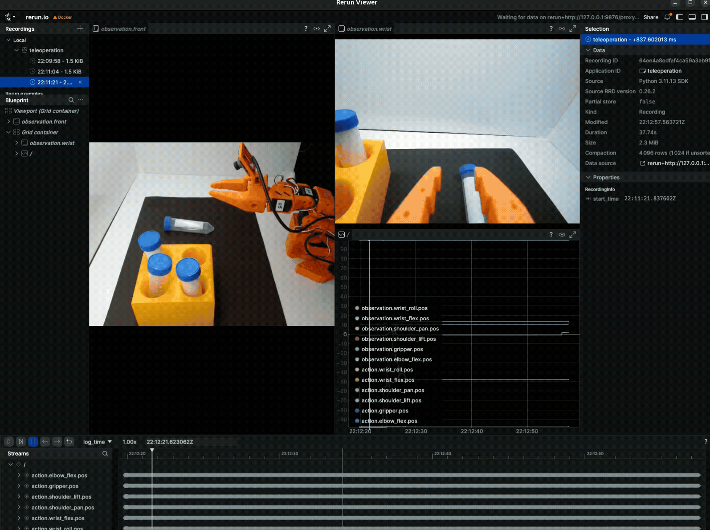

# Operating the SO-101[#](#operating-the-so-101 "Link to this heading")

What Do I Need for This Module?

Hands-on. You’ll need the calibrated SO-101 robot, teleop arm, both cameras, and the Docker container running from [Calibrating the SO-101](07-calibrating-so101.html).

In this session, you’ll teleoperate the SO-101 using the leader arm, configure cameras, and run teleoperation with live camera views in Rerun.

This will give you hands-on practice operating the robot in general, but also with this specific task.

Make sure you have completed [Calibrating the SO-101](07-calibrating-so101.html) first. You’ll need a calibrated robot and the Docker container running with environment variables set.

Tip

If you encounter hardware issues during this session, see the [Troubleshooting Guide](troubleshooting.html) for solutions to common problems.

## Learning Objectives[#](#learning-objectives "Link to this heading")

By the end of this session, you’ll be able to:

- **Teleoperate** the robot using the teleoperation arm
- **Configure** cameras so you can teleoperate using the same camera views our AI models will use, and Rerun for debugging

## Safety[#](#safety "Link to this heading")

Before powering on or running policies:

- Keep hands clear of robot pinch zones while motors are enabled.
- Verify cables are routed to avoid snagging during motion.
- Be ready to stop execution with **CTRL+C** or unplug power cables if needed.
- Re-check workspace placement after moving any equipment.

## Teleoperation[#](#teleoperation "Link to this heading")

Now that both arms are calibrated, we’re ready to begin teleoperating!

1. **Begin** the teleoperation process. It’s a good idea to make sure both arms are in similar poses, because the robot will move to match the teleop arm.

```
lerobot-teleoperate \
--robot.type=so101\_follower \
--robot.port=$ROBOT\_PORT \
--robot.id=$ROBOT\_ID \
--teleop.type=so101\_leader \
--teleop.port=$TELEOP\_PORT \
--teleop.id=$TELEOP\_ID
```

2. **Move** the teleop arm and watch how the robot arm moves to match.
3. **Try** to pick up a vial and place it in the rack!
4. **Press Ctrl+C** in the terminal to stop the teleoperation.

## Camera Setup[#](#camera-setup "Link to this heading")

The teleoperation you just did used an incredible vision system: your human perception system.

Our AI model will not have this information, so we need to use the cameras instead when we collect demonstrations.

Each robot workspace today is equipped with **two cameras**:

- **Gripper camera**: Mounted on the robot’s wrist/gripper
- **External camera**: Stationary camera viewing the workspace from above or the side

And because the policy works off of these visual images, camera assignment is critical to policy performance. If they are swapped (gripper cam thinks it’s the external cam, or vice versa), the policy will fail.

Why Two Cameras?

The gripper camera becomes occluded after the robot grasps an object like a vial.

The external camera provides continuous visibility of the workspace throughout the entire manipulation sequence, ensuring the policy always has usable visual input even when the gripper camera is blocked.

### Finding Available Cameras[#](#finding-available-cameras "Link to this heading")

Similar to the port finder, LeRobot has a tool for identifying available cameras.

We need to determine the id of both the camera on the robot, and the external stationary camera.

1. **Make sure** the two cameras’ USB cables are plugged into your computer.
2. **Run** the command:

```
lerobot-find-cameras opencv
```

This command captures an image from each available camera, allowing you to determine the index of each camera.

Example output:

```
Searching for cameras...
Found 3 cameras:
Camera 0: /dev/video0 (USB 2.0 Camera)
Camera 1: /dev/video2 (USB 2.0 Camera)
Camera 2: /dev/video4 (Integrated Webcam)
Capturing test frames...
Camera 0: 640x480 @ 30fps - saved to ./camera\_test/cam\_0.jpg
Camera 1: 640x480 @ 30fps - saved to ./camera\_test/cam\_1.jpg
Camera 2: 1280x720 @ 30fps - saved to ./camera\_test/cam\_2.jpg
```

3. **Open** a new terminal outside of the docker container.
4. **Navigate** to the task repository:

```
cd ~/Sim-to-Real-SO-101-Workshop
```

5. **Run** this command to open the folder with the images:

```
open ./outputs/captured\_images
```

6. **Open** each image, and **note** which index correlates to wrist and stationary camera. For instance `opencv__dev_video0.png` indicates an index of `0`.
7. **Return** to the terminal inside the `teleop-docker` container.
8. **Assign** these to environment variables in your terminal - make sure to update the values to match what you saw in the last command.

```
setenv CAMERA\_GRIPPER=4 # make sure to update to your values
setenv CAMERA\_EXTERNAL=6 # make sure to update to your values
```

Important

**Camera Index Warning**

Camera indices may change any time cameras are unplugged or replugged into your computer. Always verify camera assignments before collecting data or running policies.

If you see unexpected behavior during teleoperation or policy execution, camera index reassignment is a common cause.

Tip

Having camera or hardware issues?
See the [Troubleshooting Guide](troubleshooting.html), also available on the sidebar, for common solutions and detailed diagnostic steps.

See the [Quick Reference](quick_reference.html) for common commands.

Note

Notice what makes this task challenging:

- the gripper camera becomes occluded after grasp
- the rack requires precise placement
- lack of depth data makes rack alignment difficult

## Run Teleoperation With Cameras[#](#run-teleoperation-with-cameras "Link to this heading")

Now that we have the camera indices, we can run teleoperation with the real cameras in your workspace.

1. **Run** the command:

```
lerobot-teleoperate \
--robot.type=so101\_follower \
--robot.port=$ROBOT\_PORT \
--robot.id=$ROBOT\_ID \
--teleop.type=so101\_leader \
--teleop.port=$TELEOP\_PORT \
--teleop.id=$TELEOP\_ID \
--display\_data=true \
--robot.cameras='{
"wrist": {
"type": "opencv",
"index\_or\_path": '"$CAMERA\_GRIPPER"',
"width": 640,
"height": 480,
"fps": 30
},
"front": {
"type": "opencv",
"index\_or\_path": '"$CAMERA\_EXTERNAL"',
"width": 640,
"height": 480,
"fps": 30
}
}'
```

[](_images/rerun_viewer_teleop_hq.gif)

Rerun Viewer Teleop Example[#](#id2 "Link to this image")

This will launch the teleoperation interface. You should see two cameras, one on the wrist and one externally mounted on the lightbox. Make sure your camera views and props roughly match this setup.

This is a valuable tool for both teleoperation and debugging.

2. Now using the **Rerun** viewer that opened, **try** picking up vials and placing them in the rack **only using the camera views**, not your eyes. See if you can perform the task a few times.

We’ll spend some time here - try to do several picks. Emphasize smooth, direct movements.

3. **Press Ctrl+C** to stop the teleoperation.
4. **Close** the Rerun viewer if it’s still open.

## Key Takeaways[#](#key-takeaways "Link to this heading")

- Camera assignment directly affects policy performance
- How tricky this task is - gripper camera becomes occluded after grasp, external camera provides continuous visibility
- The Rerun viewer is a valuable debugging tool for verifying camera views and robot state

## Resources[#](#resources "Link to this heading")

- [SO-101 Getting Started Guide](https://huggingface.co/docs/lerobot/en/so101) — Full assembly, motor setup, and calibration instructions
- [Rerun](https://rerun.io/) — A tool for visualizing camera views and robot actions

## What’s Next?[#](#what-s-next "Link to this heading")

With your robot ready, apply your first sim-to-real strategy. In the next session, [Sim-to-Real Strategy 1: Domain Randomization With Teleoperation](09-strategy1-dr-teleop.html), you’ll collect demonstrations in simulation with domain randomization.

On this page
