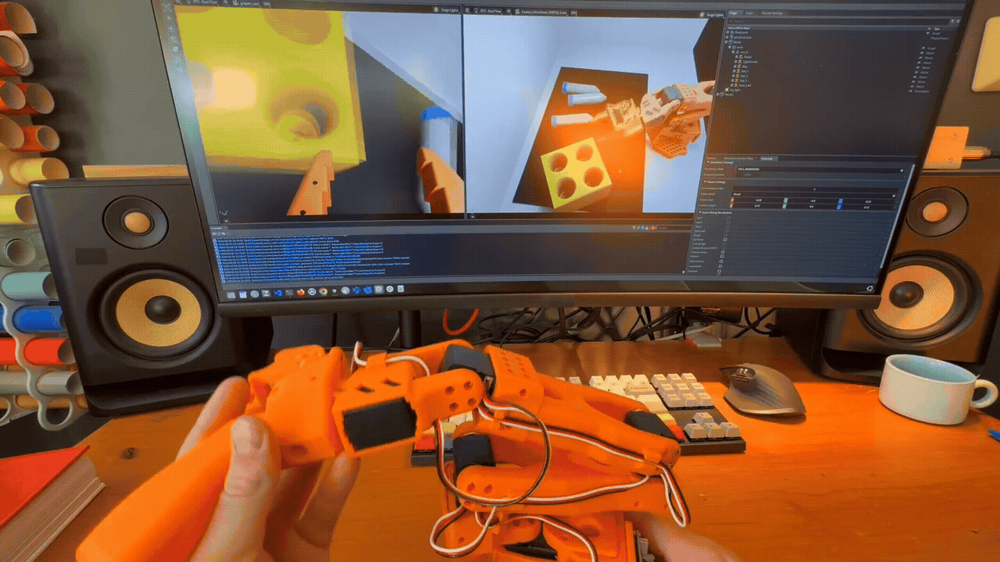
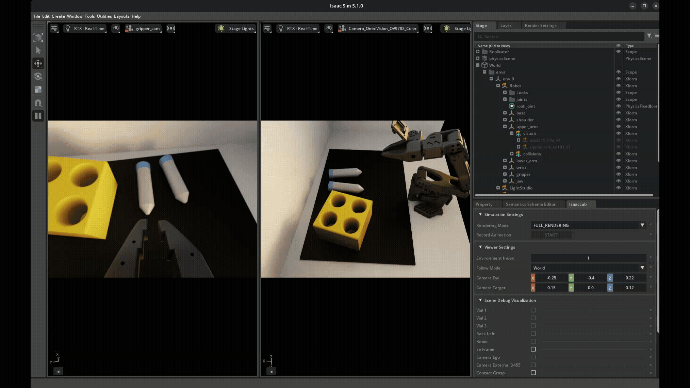
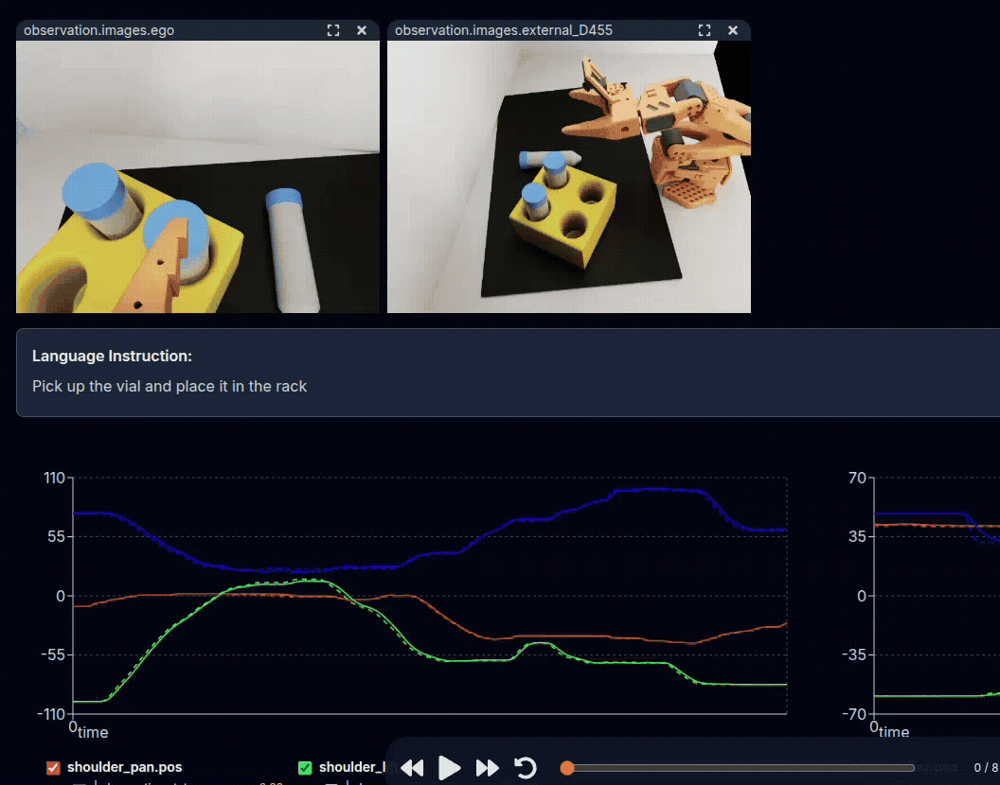
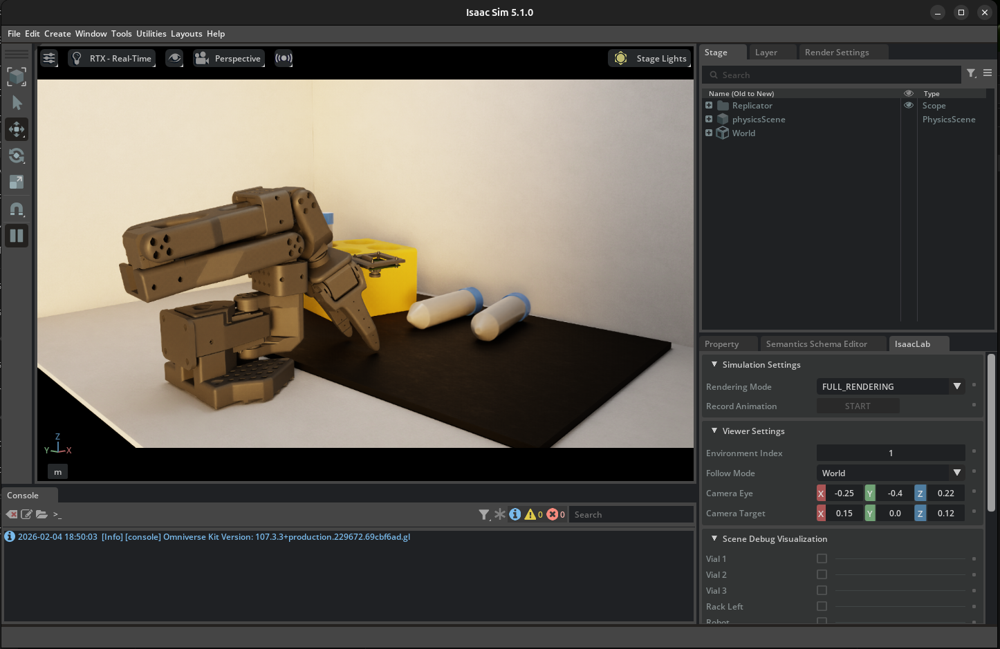
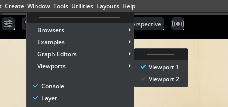
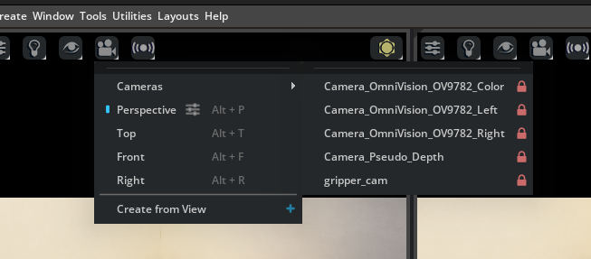
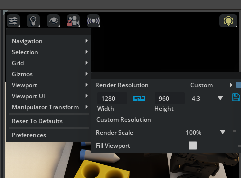
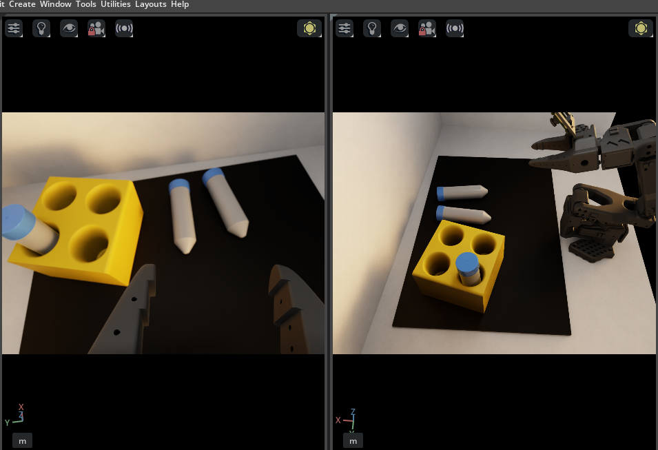

# Sim-to-Real Strategy 1: Domain Randomization[#](#sim-to-real-strategy-1-domain-randomization "Link to this heading")

What Do I Need for This Module?

Hands-on. You’ll need the `teleop-docker` container, the SO-101 teleop arm, and an NVIDIA GPU for Isaac Lab simulation.

Now that you’ve done teleoperation on a real robot, let’s try it in *simulation* with Isaac Lab.

In this module, you’ll use the teleop arm to drive a simulated SO-101 robot, allowing us to collect demonstrations with Isaac Lab.

Because it’s simulation, we have control of the world and can manipulate it in interesting ways, like using **domain randomization** to ensure our dataset will be sufficiently varied.

[](_images/teleop_in_sim.gif)

Teleoperation in Simulation[#](#id1 "Link to this image")

## Learning Objectives[#](#learning-objectives "Link to this heading")

By the end of this session, you’ll be able to:

- **Explain** domain randomization and why it improves sim-to-real transfer
- **Collect** demonstration data through teleoperation, in simulation
- **Apply** domain randomization to augment demonstrations

## What Is Domain Randomization?[#](#what-is-domain-randomization "Link to this heading")

Domain randomization (DR) is a sim-to-real strategy based on this idea: instead of making simulation perfectly match reality, randomize simulation parameters during training so the policy becomes robust to any value in the range, including real-world values.

Put in simple terms: think about how you might learn to catch a ball.

If you always catch it in the same pose, you might not learn to *reach* and catch the ball, or hold the glove in different orientations. By varying where the ball is thrown to you when you practice, you will likely learn a better “policy” for catching the ball.

What should we randomize?

There is no single answer for what to randomize. But a good rule of thumb is to randomize **parameters that are likely to vary in the real world**, or to change in the robot’s environment.

Let’s analyze what worked well for this case study of the SO-101 with a vial rack.

[](_images/teleop-domain-randomization.gif)

Domain Randomization Example. Each time the scene is reset, a number of parameters are randomized within given ranges.[#](#id2 "Link to this image")

**Visual Domain Randomization:**

- Object colors, textures, materials
- Lighting intensity, direction, color temperature
- Camera position, orientation, field of view
- Background appearance

Other examples of visual domain randomization include:

**Physics Domain Randomization:**

- Object mass, friction, restitution
- Joint damping, friction, limits
- Actuator delays, noise, offsets
- Sensor noise characteristics

Strengths and Limitations

**Strengths:**

- No real-world data required for augmentation
- Handles unknown parameters
- Scales to many parameters
- Simple to implement

**Limitations:**

- More art than science (tuning ranges)
- Trades optimality for robustness
- May produce conservative, slow motions
- Doesn’t work well for highly dynamic tasks

## Teleoperation: Collecting Human Demonstrations[#](#teleoperation-collecting-human-demonstrations "Link to this heading")

In this lesson we’ll apply domain randomization during teleoperation. We will use these to perform a kind of robot learning known as *imitation learning*.

Why Imitation Learning? (expand to read)

Teleoperation enables us to capture human expertise in action, allowing the system to benefit from the natural, intuitive motions people provide when performing tasks.

Humans instinctively know what matters for task success, leading to demonstrations that reflect important aspects of the job.

This process also brings in diversity, as different individuals may approach the same task in unique ways. Most importantly, demonstrations collected through teleoperation reliably represent successful task completion, ensuring high-quality data for imitation learning.

## Hands-On: Collecting Demonstrations[#](#hands-on-collecting-demonstrations "Link to this heading")

Here is a video of the task:

[](_images/sim-teleop-example-huggingface.gif)

Example: Teleoperation of SO-101, being replayed through the LeRobot Dataset Visualizer.[#](#id3 "Link to this image")

On top are the observations from cameras, and below are the positions of robot joints.

See this dataset on Hugging Face, using the [Dataset Visualizer](https://huggingface.co/spaces/lerobot/visualize_dataset?path=%2Fsreetz-nv%2Fso101_teleop_vials_rack_left%2Fepisode_29%3Ft%3D0)

Tip

Having trouble with cameras or robot connection? See the [Troubleshooting Guide](troubleshooting.html).

### Launch Simulation Environment (Docker)[#](#launch-simulation-environment-docker "Link to this heading")

1. If you still have the `teleop-docker` container’s terminal open from the last module, you can skip this step. If not, **expand** the dropdown and **run** the command.

Start the Isaac Sim container used for sim teleop and sim evaluation:

```
cd ~/Sim-to-Real-SO-101-Workshop
xhost +
docker run --name teleop -it --privileged --gpus all -e "ACCEPT\_EULA=Y" --rm --network=host \
-e "PRIVACY\_CONSENT=Y" \
-e DISPLAY \
-v /dev:/dev \
-v /run/udev:/run/udev:ro \
-v $HOME/.Xauthority:/root/.Xauthority \
-v ~/docker/isaac-sim/cache/kit:/isaac-sim/kit/cache:rw \
-v ~/docker/isaac-sim/cache/ov:/root/.cache/ov:rw \
-v ~/docker/isaac-sim/cache/pip:/root/.cache/pip:rw \
-v ~/docker/isaac-sim/cache/glcache:/root/.cache/nvidia/GLCache:rw \
-v ~/docker/isaac-sim/cache/computecache:/root/.nv/ComputeCache:rw \
-v ~/docker/isaac-sim/logs:/root/.nvidia-omniverse/logs:rw \
-v ~/docker/isaac-sim/data:/root/.local/share/ov/data:rw \
-v ~/docker/isaac-sim/documents:/root/Documents:rw \
-v ~/.cache/huggingface/lerobot/calibration:/root/.cache/huggingface/lerobot/calibration \
-v ./docker/env:/root/env \
-v $(pwd)/source:/workspace/Sim-to-Real-SO-101-Workshop/source \
-v $(pwd)/outputs:/workspace/Sim-to-Real-SO-101-Workshop/outputs \
-v $(pwd)/datasets:/workspace/Sim-to-Real-SO-101-Workshop/datasets \
-v $(pwd)/docker/real/scripts:/workspace/Sim-to-Real-SO-101-Workshop/docker/real/scripts \
teleop-docker:latest
```

### Practice Teleoperation in Simulation[#](#practice-teleoperation-in-simulation "Link to this heading")

Let’s launch the simulation environment to practice teleoperation without recording.

This is a good way to get familiar with the teleop controls and camera views before collecting data.

1. (Optional) **Run** this quick sanity check to make sure your environment variables are set correctly.

```
echo "Teleop port is ${TELEOP\_PORT} with id ${TELEOP\_ID}"
```

If they aren’t set, find the ports using `lerobot-find-port` and assign them again:

Example of setting port vars

```
setenv TELEOP\_PORT=/dev/ttyACM # !! make sure to update
setenv ROBOT\_PORT=/dev/ttyACM # !! make sure to update
setenv TELEOP\_ID=orange\_teleop # use this line as-is
setenv ROBOT\_ID=orange\_robot # use this as-is
```

2. **Move** the teleop arm to a packed position. If the robot is in a strange starting position, it may run into items in simulation on startup.
3. **Run** the following command to open Isaac Lab, with our pre-configured simulation environment. You can choose between two options: `Lerobot-So101-Teleop-Vials-To-Rack` which has no domain randomization or `Lerobot-So101-Teleop-Vials-To-Rack-DR`, which has domain randomization enabled.

```
lerobot\_agent --task Lerobot-So101-Teleop-Vials-To-Rack-DR
```

This will launch Isaac Sim and load the training environment.

Note

The first time this launches, it will take about 2 minutes to load.

If it gets stuck, check the console for errors. It’s likely the robot isn’t fully connected. Power cycle the robot (plug/replug power on the back) if you have issues.



4. **Keep** Isaac Lab open for the next step.

### Setup Cameras[#](#setup-cameras "Link to this heading")

We need our simulation to show us the same camera views our AI model will use.

When doing teleoperation for training VLAs, it’s crucial that we use the same camera views for teleoperation that the model will use for autonomous operation.

Otherwise, we may introduce biases or advantages the model won’t have.

Important

**Only look through the gripper and external cameras when teleoperating.**

When looking at the scene with your own eyes, or other cameras in the simulation scene, you may introduce perceptual affordances that the model will not have access to during inference.

The policy will only see what the cameras see. Train yourself to rely solely on the camera views displayed on your screen. This ensures your demonstrations reflect what the policy can actually perceive.

By default you’ll just see the general perspective camera. Let’s fix that.

1. **Go** to **Window > Viewports**, and **enable** both viewport *Viewport 1* and *Viewport 2* so we can see two cameras rendered at once.




2. In one viewport, **go** to the **camera menu**, and **choose** the `gripper_cam`.



3. In the other viewport, **go** to the **camera menu**, and **choose** the `Camera_OmniVision_9782_Color` camera.

For each viewport, **set** the aspect ratio to 4:3 to match the cameras.

4. Go to the **settings menu** in the viewport.
5. **Under** **Viewport > Aspect Ratio** on the right side you’ll see `16:9`. **Change** it to `4:3`.
   
   
6. Now try teleoperating, and take some time to get familiar with the teleop controls and camera views before collecting data in episodic format.
7. **Press** **R** to reset the environment with domain randomization. If it doesn’t work, **click** on the viewport to give the application focus, and **try** again.
8. **Notice** in the terminal, you will see status updates about the subtask success, such as when the vials are grasped or placed in the rack.

**Controls (click in Viewport to use these commands)**

- **Press** **R** to reset the environment (also stops recording)
- Episodes are queued for processing while you continue working

9. When finished, **stop** Isaac Lab by pressing **CTRL+C** in the terminal.

### Start Recording Demonstrations[#](#start-recording-demonstrations "Link to this heading")

When ready to collect data, we’ll add a few extra arguments for where to save the data we collect.

Before launching the teleop agent, set your Hugging Face username as an environment variable. This is used to organize your datasets in a unique namespace.

If you don’t have one, or don’t want to login, you can make up a username for local data collection.

1. **Run** this, replacing `your-hf-username` with your actual Hugging Face username:

```
export HF\_USER=your-hf-username
```

You only need to do this once per terminal session before running the following commands. Feel free to use a made up username if you don’t want to login and upload your demos.

### Overall Flow[#](#overall-flow "Link to this heading")

For each episode we will:

1. **Reset the environment**: **Press** **R** to randomize vial positions, rack position, camera poses, and lighting. You can do this every episode, or every few episodes.
2. **Record**: **Press** **S** to start recording.
3. **Execute**: Immediately **begin** the demonstration. For each episode, perform one pick-and-place operation, which means picking up one vial and placing it into one open slot on the rack.
4. **Complete**: **Press** **S** to stop recording

How many demonstrations should you collect? If you’re going to train your own policy, try collecting **at least 70 demonstrations** based on our experience. More could be better. If you’re just exploring, you can collect less.

**Demonstration Quality Guidelines:**

**Good demonstrations:**

- Smooth, deliberate motions
- Clear grasp contact with vial
- Successful placement in rack

**Avoid:**

- Jerky, hesitant motions
- Missed grasps or drops
- Including more than the actual task execution

### Recording Demonstrations[#](#recording-demonstrations "Link to this heading")

1. **Launch** recording session. This will be just like the environment before, but we have additional controls to cancel, start recording, and stop recording.

```
lerobot\_agent --task Lerobot-So101-Teleop-Vials-To-Rack-DR \
--repo\_id ${HF\_USER}/so101\_teleop\_vials \
--repo\_root $(pwd)/datasets/so101\_teleop\_vials \
--task\_name "Pick up the vial and place it in the rack"
```

2. **Set up** the window, viewports, and cameras (same as in **Practice Teleoperation**):

   - **Window > Viewport**: **Enable** both viewports so you see two camera views at once.
   - In one viewport, **open** the camera menu and **choose** **gripper\_cam**.
   - In the other viewport, **open** the camera menu and **choose** **Camera\_OmniVision\_9782\_Color**.
   - For each viewport: **open** the viewport settings, **go** to **Viewport > Aspect Ratio**, and **set** to **4:3** (instead of 16:9).
3. **Recording Controls:**
   Isaac Sim viewport must be in “focus” (**click** the app’s UI)

- **Press** **S** to start/stop recording an episode
- **Press** **C** to cancel the current recording (useful for mistakes)
- **Press** **R** to reset the environment (also stops recording)
- Completed episodes are queued for processing so you can continue working.

Example terminal output:

```
[INFO]: Started recording.
[INFO]: Stopped recording.
[INFO]: Copy episode to CPU...
[INFO]: Episode added to queue.
[INFO]: [ASYNC] received episode from queue...
[INFO]: Cleared buffers
```

4. Repeat the recording process until you have collected the desired number of demonstrations.
5. When completely finished with all demonstrations, **make sure** you see the message `[INFO]: No More episodes in queue`. Wait a few seconds if you don’t see it. This means all the episodes have been processed and saved.
6. **Stop** Isaac Lab by pressing **CTRL+C** in the terminal.

### Review Collected Data[#](#review-collected-data "Link to this heading")

1. Optional: if you recorded a demonstration, **use** the LeRobot dataset visualizer to review your recorded episodes:

```
lerobot-dataset-viz \
--repo-id ${HF\_USER}/so101\_teleop\_vials \
--root $(pwd)/datasets/so101\_teleop\_vials \
--episode-index 0
```

Change `--episode-index` to view different episodes.

## Domain Randomization in Simulation[#](#domain-randomization-in-simulation "Link to this heading")

To maximize domain randomization benefits, collect demonstrations across multiple sessions. The environment randomizes conditions between episodes automatically.

Let’s take a look at the code.

### Code Tour: Domain Randomization Implementation[#](#code-tour-domain-randomization-implementation "Link to this heading")

The Isaac Lab environment implements DR through reset event handlers. Here’s a tour of the key randomization methods from the teleop environment codebase.

In the workshop repo, these randomizations are applied in DR task variants (for example, `Lerobot-So101-Teleop-Vials-To-Rack-DR`). The base `Lerobot-So101-Teleop-Vials-To-Rack` task keeps the sky light off and uses a fixed orange robot color.

**Lighting Randomization** (`randomize_sky_light`)

*File: `sim_to_real_so101/source/sim_to_real_so101/mdp/resets.py`*

Randomizes the environment’s dome light on each reset—exposure, color temperature, and HDRI texture:

```
1def randomize\_sky\_light(
2 env,
3 env\_ids: torch.Tensor | None,
4 exposure\_range: tuple[float, float],
5 temperature\_range: tuple[float, float],
6 textures\_root: str,
7 asset\_cfg: SceneEntityCfg = None,
8):
9 # Sample random exposure and color temperature
10 exposure = math\_utils.sample\_uniform(\*exposure\_range, (1,), device="cpu").item()
11 temperature = math\_utils.sample\_uniform(\*temperature\_range, (1,), device="cpu").item()
12
13 # Select random HDRI texture from available options
14 textures = glob.glob(os.path.join(textures\_root, "\*.exr"))
15 texture = textures[torch.randint(0, len(textures), (1,)).item()]
16
17 # Apply to the dome light
18 prim.GetAttribute("inputs:exposure").Set(exposure)
19 prim.GetAttribute("inputs:colorTemperature").Set(temperature)
20 prim.GetAttribute("inputs:texture:file").Set(Sdf.AssetPath(texture))
```

**Camera Pose Randomization** (`randomize_camera_pose`)

*File: `sim_to_real_so101/source/sim_to_real_so101/mdp/resets.py`*

Adds small position and rotation offsets to the external camera:

```
1def randomize\_camera\_pose(
2 env,
3 env\_ids: torch.Tensor | None,
4 prim\_path\_pattern: str,
5 pos\_range: dict[str, tuple[float, float]] = None, # e.g., {"x": (-0.02, 0.02)}
6 rot\_range: dict[str, tuple[float, float]] = None, # e.g., {"pitch": (-0.05, 0.05)}
7):
8 # Sample random offsets relative to USD default pose
9 x = base\_pos[0] + math\_utils.sample\_uniform(\*pos\_range.get("x", (0, 0)), (1,)).item()
10 y = base\_pos[1] + math\_utils.sample\_uniform(\*pos\_range.get("y", (0, 0)), (1,)).item()
11 z = base\_pos[2] + math\_utils.sample\_uniform(\*pos\_range.get("z", (0, 0)), (1,)).item()
12
13 # Combine base quaternion with random delta rotation
14 delta\_quat = math\_utils.quat\_from\_euler\_xyz(roll, pitch, yaw)
15 final\_quat = math\_utils.quat\_mul(base\_quat\_tensor, delta\_quat)
```

**Object Pose Randomization** (`reset_vials_rack`)

*File: `sim_to_real_so101/source/sim_to_real_so101/mdp/resets.py`*

Randomizes vial and rack positions, with probability of pre-placing vials in slots:

```
1def reset\_vials\_rack(
2 env,
3 env\_ids: torch.Tensor,
4 vials: list[str],
5 rack: str,
6 rack\_pose\_range: dict[str, tuple[float, float]],
7 pose\_range: dict[str, tuple[float, float]],
8 rack\_placement\_prob: float = 0.33,
9):
10 # Randomize rack position and orientation
11 new\_rack\_positions, new\_rack\_orientations = random\_asset\_pose(
12 env, env\_ids, rack, rack\_pose\_range, {}
13 )
14
15 # With some probability, pre-place a vial in a random slot
16 if torch.rand(1).item() < rack\_placement\_prob:
17 vial\_idx = torch.randint(0, len(vial\_objects), (1,)).item()
18 slot\_idx = torch.randint(0, total\_slots, (1,)).item()
19 # Transform slot position from rack local frame to world frame
20 slot\_position, slot\_orientation = math\_utils.combine\_frame\_transforms(
21 new\_rack\_positions, new\_rack\_orientations,
22 slot\_position\_local, slot\_orientation\_local
23 )
24 vial.write\_root\_pose\_to\_sim(slot\_pose, env\_ids=env\_ids)
```

**Wiring It Up: Event Configuration**

*File: `sim_to_real_so101/source/sim_to_real_so101/tasks/task_env_cfg.py`*

These randomization functions are registered as reset events in the environment config:

```
1@configclass
2class TaskEventCfg(EventCfg):
3
4 reset\_sky\_light = EventTerm(
5 func=randomize\_sky\_light,
6 mode="reset",
7 params={
8 "exposure\_range": (-4.0, 3.0),
9 "temperature\_range": (2500.0, 9500.0),
10 "textures\_root": f"{assets\_path}/hdri",
11 "asset\_cfg": SceneEntityCfg("sky\_light"),
12 },
13 )
14
15 reset\_camera\_external\_pose = EventTerm(
16 func=randomize\_camera\_pose,
17 mode="reset",
18 params={
19 "prim\_path\_pattern": "{ENV\_REGEX\_NS}/LightStudio/LightBox/camera\_mount",
20 "pos\_range": {"x": (-0.02, 0.02), "y": (-0.02, 0.02), "z": (-0.01, 0.01)},
21 "rot\_range": {"roll": (-0.05, 0.05), "pitch": (-0.05, 0.05), "yaw": (-0.05, 0.05)},
22 },
23 )
```

Every time an episode resets, Isaac Lab calls each registered `EventTerm` with `mode="reset"`, applying fresh randomization.

For this workshop migration, the mat yaw randomization range is tightened to `(-0.1, 0.1)` in DR task configs.

Tip

You can experiment with domain randomization by changing the ranges or which resets run. In `task_env_cfg.py`, the `TaskEventCfg` class registers each randomization as an `EventTerm` with a `params` dict. For example, adjust `exposure_range` or `temperature_range` in `reset_sky_light`, or `pos_range` / `rot_range` in `reset_camera_external_pose`, to widen or narrow variation. Commenting out an `EventTerm` disables that randomization.

Note where you’re editing - if inside the container, changes might be lost on restart.

### Subtask Rating[#](#subtask-rating "Link to this heading")

Notice in the terminal output, that our simulation can detect when the vial is grasped, and when it is placed in the rack.

```
[GRASP] Vial grasped in env(s): [0]
[RELEASE] Vial released in env(s): [0]
[RACK] vial\_2 placed in rack in env(s): [0]
```

This strategy is useful when we start policy inference, because we can automatically score how well the policy is performing.

### Sim vs. Real Teleoperation Comparison[#](#sim-vs-real-teleoperation-comparison "Link to this heading")

| Aspect | Simulation | Real Robot |
| --- | --- | --- |
| Domain randomization | Automatic | Manual, limited to what you can physically change in the environment |
| Data collection speed | Faster reset, parallel envs possible | Real-time only |
| Hardware wear | None | Accumulates over time |
| Visual diversity | Procedural generation | Requires manual variation |
| Physics accuracy | Approximated | Ground truth |

### When to Use Each[#](#when-to-use-each "Link to this heading")

**Use simulation when:**

- Building initial dataset with DR
- Hardware is limited or shared
- Exploring task or policy variations quickly and safely
- Real environment isn’t ready, accessible, or during development

**Use real robot when:**

- Collecting high-quality ground truth
- Validating sim-trained policies
- Capturing real-world nuances (friction, lighting)

## Key Takeaways[#](#key-takeaways "Link to this heading")

- Domain randomization makes policies robust by training on varied conditions
- Teleoperation captures human expertise in demonstration form
- Always teleoperate using only camera views—not your eyes
- DR augmentation multiplies your dataset with varied conditions
- Combined real demonstrations + DR augmentation is a powerful baseline

## What’s Next?[#](#what-s-next "Link to this heading")

With augmented demonstrations collected, learn how policies are trained and served. In the next session, [Isaac GR00T: Vision-Language-Action Models](10-groot.html), you’ll study VLAs and the GR00T architecture before running evaluations.

On this page
