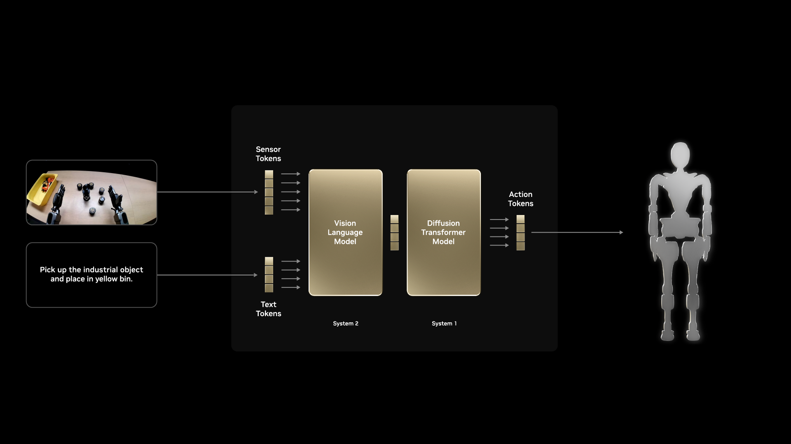

# Isaac GR00T: Vision-Language-Action Models[#](#isaac-gr00t-vision-language-action-models "Link to this heading")

What Do I Need for This Module?

Mostly theory with code examples. No additional hardware is required beyond a computer with the `real-robot` container built.

In this session, we’ll explore the VLA model called NVIDIA Isaac GR00T, how it works, and see examples of it in action.

## Learning Objectives[#](#learning-objectives "Link to this heading")

By the end of this session, you’ll be able to:

- **Explain** what vision-language-action models are and why they’re powerful
- **Describe** the GR00T architecture and its components
- **Understand** how VLAs differ from traditional robot learning approaches

## What Is GR00T?[#](#what-is-gr00t "Link to this heading")

[NVIDIA Isaac GR00T](https://developer.nvidia.com/isaac/gr00t) (Generalist Robot 00 Technology) is a research initiative and development platform for developing general-purpose robot foundation models and data pipelines to accelerate humanoid robotics research and development.

It provides:

- **Pre-trained visual understanding** from large-scale data
- **Language-conditioned behavior** for flexible task specification
- **Action generation** suitable for real-time robot control

In this course, we’ll use GR00T N1.6 models post-trained for the SO-101 robot.

Note

**Training time in this course**

GR00T post-training requires several hours on GPU hardware. We have pre-trained a set of policies on various datasets that you can use as a start. This lets you focus on understanding the workflow, evaluating results, and iterating on strategies rather than waiting for training jobs to complete.

The commands and scripts shown here are the same ones used to produce those policies, so you can replicate the process on your own hardware after you finish this learning path.

## What Is a Vision-Language-Action Model?[#](#what-is-a-vision-language-action-model "Link to this heading")

**Vision-Language-Action (VLA) models** are foundation models that take visual input and language instructions and output low-level or mid-level actions for an embodied agent, such as a robot.

```
Input: Camera image (1 or more) + "Pick up the red vial and place it in the rack"
Output: Sequence of joint positions/velocities to execute the task
```

### Defining Terminology[#](#defining-terminology "Link to this heading")

#### Understanding VLA Training Stages[#](#understanding-vla-training-stages "Link to this heading")

VLA models are not trained in a single step. They go through distinct phases, each building on the previous one.

Understanding these stages helps explain how a model progresses from broad world knowledge to task-specific robot behavior, and why each phase matters for sim-to-real transfer.

**Pre-training** is the first and largest training phase. The model learns general representations from internet-scale data, including images, text, video, and increasingly, robot demonstrations.

No specific robot task is being taught yet. Instead, the model develops broad capabilities such as object recognition, spatial reasoning, and grounding language in visual context. You can think of this as building a world model before the model ever sees your specific robot task.

**Post-training** is the umbrella term for everything that happens after pre-training to make a general model useful for a specific robot, task, or environment.

This is where a pretrained foundation model is adapted to a specific embodiment and task using demonstrations that map observations and language instructions to robot actions. Post-training is computationally intensive and typically requires several hours on GPU hardware.

Note

This is the stage you run in this course: taking the pretrained GR00T N1.6 foundation model and adapting it to SO-101 data collected in simulation.

**Fine-tuning** is a specific form of post-training where you continue training on a smaller, targeted dataset to improve performance in a specific setting.

For example, after post-training on simulation data, you might fine-tune on a small set of real-robot demonstrations to reduce the sim-to-real gap. Fine-tuning aims to preserve general capabilities while adapting behavior to new conditions.

**Inference** is when the trained model runs in real time. It receives camera frames and a language instruction, then outputs joint position commands.

No learning happens during inference because model weights are frozen. Speed matters here. Techniques such as action chunking, where the model predicts multiple timesteps at once, reduce forward passes and produce smoother motion. On modern GPU hardware, this supports real-time closed-loop control.

### Architecture Overview[#](#architecture-overview "Link to this heading")



### Key Components[#](#key-components "Link to this heading")

**Vision Encoder**: Processes camera images into rich feature representations

- Pre-trained on large image datasets (ImageNet, etc.)
- Understands objects, spatial relationships, affordances

**Language Encoder**: Processes task instructions

- Maps natural language to task embeddings
- Enables zero-shot generalization to new task descriptions

**Cross-Modal Fusion**: Combines vision and language

- Attention mechanisms to relate visual features to language
- Grounds language concepts in visual observations

**Action Decoder**: Generates robot actions

- Conditioned on fused visual-language features
- Outputs appropriate action representation (joint positions, velocities, etc.)

## Action Space and Control[#](#action-space-and-control "Link to this heading")

### Action Representations[#](#action-representations "Link to this heading")

GR00T supports several action representations:

**Joint Position Actions**

- Direct control over robot configuration
- Requires learning full arm coordination

**End-Effector Actions**

- Inverse kinematics computes joint commands
- Abstracts away arm configuration

**Action Chunking**

- Predict multiple future actions at once
- Smoother execution, temporal consistency

In this course, we use **joint position actions with action chunking**.

### Action Horizon Parameter[#](#action-horizon-parameter "Link to this heading")

The `action_horizon` parameter controls how many future actions the model predicts at once. This is a critical hyperparameter that affects both training and deployment.

**What it controls:**

- **Training**: The model learns to predict `action_horizon` timesteps into the future
- **Inference**: The model outputs a chunk of `action_horizon` actions per forward pass

**Trade-offs:**

| Horizon | Pros | Cons |
| --- | --- | --- |
| Short (4-8) | More reactive, corrects quickly | Choppy motion, frequent replanning |
| Medium (16) | Balanced smoothness and reactivity | Good default for most tasks |
| Long (32+) | Very smooth trajectories | Slow to correct errors, may overshoot |

Tip

Start with the default `action_horizon=16`. Only adjust if you observe specific issues: reduce if the robot overshoots targets, increase if motion is too jerky.

## Hands-On: Run GR00T Post-Training Yourself[#](#hands-on-run-gr00t-post-training-yourself "Link to this heading")

You can follow either path:

- Use the fine-tuned models we provide in this course. In this case, skip this module.
- Run your own post-training workflow using the steps below. You can also use your own hardware - we recommend the Brev Launchable route because it sets up the environment for you.

Note

Make sure to update to match your repo IDs throughout this section. Example ones are provided in commands.

1. **Launch** a GR00T Launchable instance. Brev is a pay-by-the-hour way to access GPU compute in the cloud.

   [](https://brev.nvidia.com/launchable/deploy?launchableID=env-3DfuAZZiLMXlclVQt1ddp0fEsOH)

   The Brev console may show the Lifecycle Script as `Failed`. This is fine. Connect to the instance from your local terminal:

   ```
   brev login
   brev shell <instance-name>
   ```

   Optionally, start a `tmux` session after connecting so your work continues if the network connection drops.

   Alternatively you can also train locally, in which case you’ll want to checkout the [GR00T 1.6 repo](https://github.com/NVIDIA/Isaac-GR00T/releases/tag/n1.6-release) and setup the virtual environment per the `README`.
2. **Set environment variables** to identify the Hugging Face dataset, define the conversion output location, and derive the local dataset path used by later commands.

```
export HF\_DATASET\_REPO\_ID="sreetz-nv/so101\_teleop\_vials\_rack\_left"
export CONVERSION\_ROOT="sreetz-nv\_so101\_teleop\_vials\_rack\_left\_conv"
export DATASET\_DIR="${CONVERSION\_ROOT}/${HF\_DATASET\_REPO\_ID}"
```

Replace `HF_DATASET_REPO_ID` and derived names with your own dataset naming.

3. **Convert** the LeRobot dataset from v3 format to v2 format under the conversion root.

```
cd ~/Isaac-GR00T
uv run --project scripts/lerobot\_conversion python scripts/lerobot\_conversion/convert\_v3\_to\_v2.py \
--repo-id "${HF\_DATASET\_REPO\_ID}" \
--root "${CONVERSION\_ROOT}"
```

If Hugging Face rate-limits the instance IP, authenticate and run the conversion again:

```
hf auth login
```

Alternatively, pass a [Hugging Face user access token](https://huggingface.co/settings/tokens) through the environment:

```
export HF\_TOKEN="<your-hugging-face-token>"
```

Remove the partially converted dataset, then rerun the conversion command from Step 3:

```
rm -rf "${DATASET\_DIR}"
```

4. **Copy** the SO-100 modality metadata to the converted dataset metadata directory so GR00T can interpret the dataset structure.

```
cp examples/SO100/modality.json "${DATASET\_DIR}/meta/"
```

5. **Update** the image keys in the copied metadata to match this dataset’s camera names.

```
sed -i \
-e 's|"original\_key": "observation.images.front"|"original\_key": "observation.images.ego"|g' \
-e 's|"original\_key": "observation.images.wrist"|"original\_key": "observation.images.external\_D455"|g' \
"${DATASET\_DIR}/meta/modality.json"
```

6. **Activate** the GR00T virtual environment.

```
source "/home/ubuntu/Isaac-GR00T/.venv/bin/activate"
```

7. **Set fine-tuning configuration variables** to select the GPU, define the embodiment tag, name the run, and set the training output directory.

```
export NUM\_GPUS=1
export CUDA\_VISIBLE\_DEVICES=0
export EMBODIMENT\_TAG="NEW\_EMBODIMENT"
export RUN\_NAME="so101\_teleop\_vials\_rack\_left"
export OUTPUT\_DIR="/ephemeral/${RUN\_NAME}"
```

8. **Run** fine-tuning.

```
sudo apt-get update && sudo apt-get install -y python3.12-dev
LD\_LIBRARY\_PATH="/lib/x86\_64-linux-gnu:/usr/lib/x86\_64-linux-gnu:${LD\_LIBRARY\_PATH}" \
python gr00t/experiment/launch\_finetune.py \
--base\_model\_path nvidia/GR00T-N1.6-3B \
--dataset\_path "${DATASET\_DIR}" \
--modality\_config\_path examples/SO100/so100\_config.py \
--embodiment\_tag "${EMBODIMENT\_TAG}" \
--num\_gpus "${NUM\_GPUS}" \
--output\_dir "${OUTPUT\_DIR}" \
--save\_steps 5000 \
--save\_total\_limit 5 \
--max\_steps 20000 \
--warmup\_ratio 0.05 \
--weight\_decay 1e-5 \
--learning\_rate 1e-4 \
--global\_batch\_size 64 \
--color\_jitter\_params brightness 0.3 contrast 0.4 saturation 0.5 hue 0.08 \
--dataloader\_num\_workers 4
```

On Brev, omitting `apt-get install` and `LD_LIBRARY_PATH` from the fine-tuning command may cause the following error:

```
ValueError: FlashAttention2 has been toggled on, but it cannot be used due to the following error: Flash Attention 2 is not available on CPU. Please make sure torch can access a CUDA device.
```

You may not need the two commands when training on a local machine where CUDA libraries are already discoverable.

9. **Authenticate** with Hugging Face.

```
hf auth login
```

10. **Create** the Hugging Face model repository.

```
export HF\_MODEL\_REPO="grootn16-finetune\_sreetz-so101\_teleop\_vials\_rack\_left"
hf repo create "${HF\_MODEL\_REPO}" --repo-type model --exist-ok
```

11. **Upload** model artifacts to Hugging Face.

```
# Upload full training output directory
hf upload "${HF\_MODEL\_REPO}" "${OUTPUT\_DIR}" . --repo-type model
# Or upload only the final checkpoint to a specific repository
hf upload sreetz-nv/grootn16-finetune\_sreetz-so101\_teleop\_vials\_rack\_left \
"${OUTPUT\_DIR}/checkpoint-20000" \
. \
--repo-type model
```

12. If you used Brev, and you’re sure your files are uploaded, you can stop or delete the instance to save credits.

## Practical Considerations[#](#practical-considerations "Link to this heading")

### Data Requirements[#](#data-requirements "Link to this heading")

VLA training typically requires:

- **50-200 demonstrations** per task for basic competence
- **Language annotations** describing each demonstration
- **Diverse conditions** to enable generalization

Tip

Quality matters more than quantity. 50 high-quality, diverse demonstrations often outperform 500 redundant ones.

### Compute Requirements[#](#compute-requirements "Link to this heading")

GR00T training benefits from:

- **GPU memory**: 24GB+ for full model training
- **Training time**: 2-8 hours depending on dataset size
- **Inference**: Real-time on modern GPUs (RTX 3080+)

## Key Takeaways[#](#key-takeaways "Link to this heading")

- VLA models combine vision, language, and action in a unified architecture
- GR00T provides pre-trained components for accelerated learning
- Language conditioning enables flexible task specification
- Action chunking provides smooth, temporally consistent control
- Pre-trained vision encoders enable visual generalization

## Resources[#](#resources "Link to this heading")

- [NVIDIA Isaac GR00T GitHub](https://github.com/NVIDIA/Isaac-GR00T) — Source code, model weights, and documentation

## What’s Next?[#](#what-s-next "Link to this heading")

Now that you understand VLAs conceptually, run policy evaluation in simulation. In the next session, [Sim Evaluation](11-sim-evaluation.html), you’ll compare policies in sim using open-loop and closed-loop evaluation.

On this page
