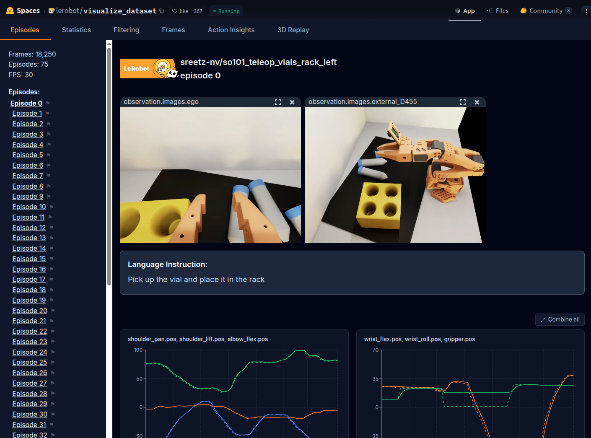
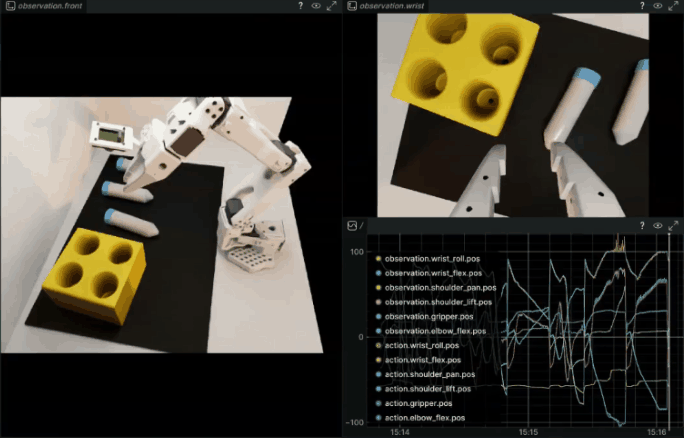

# Sim Evaluation[#](#sim-evaluation "Link to this heading")

What Do I Need for This Module?

Hands-on. You’ll need the `teleop-docker` and `real-robot` containers and an NVIDIA GPU for Isaac Lab simulation.

In this session, you’ll run policy evaluation in simulation using the same GR00T-based setup you’ll use later on the real robot.

## Learning Objectives[#](#learning-objectives "Link to this heading")

By the end of this session, you’ll be able to:

- **Run** policy evaluation in simulation using the GR00T server + client (Docker) setup
- **Compare** how policies trained with different data quantities and augmentation behave
- **Identify** common failure modes in simulation

## What Policy Are We Going to Evaluate?[#](#what-policy-are-we-going-to-evaluate "Link to this heading")

You’ll have the choice of either using policies we trained for you, or training your own. If you use ours, make sure the workspace is set up correctly and the robot is carefully calibrated.

Tip

To use GR00T with LeRobot, follow the official [LeRobot GR00T documentation](https://huggingface.co/docs/lerobot/en/groot) for setup and integration guides. GR00T N1.5 models are natively supported and can be evaluated directly within the LeRobot framework. For GR00T N1.6, integration into LeRobot is still in progress. In the meantime, you’ll need to run training and inference using the official [Isaac GR00T repository](https://github.com/NVIDIA/Isaac-GR00T) or provided Docker images for the latest model features.

We used this [dataset of 75 sim demonstrations](https://huggingface.co/datasets/sreetz-nv/so101_teleop_vials_rack_left). View it on Hugging Face with the [dataset visualizer](https://huggingface.co/datasets/sreetz-nv/so101_teleop_vials_rack_left). This is a *sim only* dataset, meaning it was trained entirely in simulation, without any real-world data. Our first strategy is to rely solely on simulation and domain randomization.

[](_images/lerobot_dataset_visualize_teleop_vials_rack_left.png)

*Sample episodes visualized from the sim-only demonstration dataset used for training evaluation policies.*[#](#id1 "Link to this image")

## Running Policy Evaluation in Simulation[#](#running-policy-evaluation-in-simulation "Link to this heading")

Throughout this course, when we run evaluations there will be two terminals involved:

1. The host terminal, where we will start the GR00T container and policy server
2. The client terminal, where we will run the evaluation rollout and actually control the robot

For sim, the client is our simulator.
For the real robot, our client is the robot itself.

### Terminal 1 (`real-robot` container) — Start the GR00T policy server[#](#terminal-1-real-robot-container-start-the-gr00t-policy-server "Link to this heading")

1. **Open** a new terminal window (**CTRL+ALT+T**).
2. **Run** the docker `real-robot` container.

```
cd ~/Sim-to-Real-SO-101-Workshop
xhost +
docker run -it --rm --name real-robot --network host --privileged --gpus all \
-e DISPLAY \
-v /dev:/dev \
-v /run/udev:/run/udev:ro \
-v $HOME/.Xauthority:/root/.Xauthority \
-v /tmp/.X11-unix:/tmp/.X11-unix \
-v ~/.cache/huggingface/lerobot/calibration:/root/.cache/huggingface/lerobot/calibration \
-v ./docker/env:/root/env \
-v ~/models:/workspace/models \
-v $(pwd)/docker/real/scripts:/Isaac-GR00T/gr00t/eval/real\_robot/SO100 \
real-robot \
/bin/bash
```

3. Inside this container, **run** the following to set which model to evaluate.

```
export MODEL=aravindhs-NV/grootn16-finetune\_sreetz-so101\_teleop\_vials\_rack\_left/checkpoint-10000
```

4. **Run** the policy server with that model.

```
python Isaac-GR00T/gr00t/eval/run\_gr00t\_server.py \
--model-path /workspace/models/$MODEL
```

5. When you see `Server is ready and listening on tcp://0.0.0.0:5555` the policy server is ready to accept connections.

### Terminal 2 (`teleop-docker` container) — Evaluation rollout[#](#terminal-2-teleop-docker-container-evaluation-rollout "Link to this heading")

1. If you still have the `teleop-docker` container’s terminal open from the last module, you can skip this step. If not, **expand** the dropdown and **run** the command.

Start the Isaac Sim container used for sim teleop and sim evaluation:

```
cd ~/Sim-to-Real-SO-101-Workshop
xhost +
docker run --name teleop -it --privileged --gpus all -e "ACCEPT\_EULA=Y" --rm --network=host \
-e "PRIVACY\_CONSENT=Y" \
-e DISPLAY \
-v /dev:/dev \
-v /run/udev:/run/udev:ro \
-v $HOME/.Xauthority:/root/.Xauthority \
-v ~/docker/isaac-sim/cache/kit:/isaac-sim/kit/cache:rw \
-v ~/docker/isaac-sim/cache/ov:/root/.cache/ov:rw \
-v ~/docker/isaac-sim/cache/pip:/root/.cache/pip:rw \
-v ~/docker/isaac-sim/cache/glcache:/root/.cache/nvidia/GLCache:rw \
-v ~/docker/isaac-sim/cache/computecache:/root/.nv/ComputeCache:rw \
-v ~/docker/isaac-sim/logs:/root/.nvidia-omniverse/logs:rw \
-v ~/docker/isaac-sim/data:/root/.local/share/ov/data:rw \
-v ~/docker/isaac-sim/documents:/root/Documents:rw \
-v ~/.cache/huggingface/lerobot/calibration:/root/.cache/huggingface/lerobot/calibration \
-v ./docker/env:/root/env \
-v $(pwd)/source:/workspace/Sim-to-Real-SO-101-Workshop/source \
-v $(pwd)/outputs:/workspace/Sim-to-Real-SO-101-Workshop/outputs \
-v $(pwd)/datasets:/workspace/Sim-to-Real-SO-101-Workshop/datasets \
-v $(pwd)/docker/real/scripts:/workspace/Sim-to-Real-SO-101-Workshop/docker/real/scripts \
teleop-docker:latest
```

2. This command will begin moving the robot in simulation, using an environment with less lighting variation to start.

```
lerobot\_eval \
--task Lerobot-So101-Teleop-Vials-To-Rack-Eval \
--rename\_map '{"external\_D455": "front", "ego": "wrist"}' \
--action\_horizon 16 \
--lang\_instruction "Pick up the vial and place it in the yellow rack" \
--rerun
```

This will launch both Isaac Sim, and Rerun.

Note

The `--rerun` flag is optional.

It adds Rerun into the loop for debugging, so you can see joint actions and the camera feeds while the policy is running. This lets you confirm the camera views are reasonable and the assignments are correct.

3. (Alternatively) You can run the evaluation **headlessly**, meaning there is no Isaac Sim UI or Rerun visualization:

```
lerobot\_eval \
--task Lerobot-So101-Teleop-Vials-To-Rack-Eval \
--rename\_map '{"external\_D455": "front", "ego": "wrist"}' \
--action\_horizon 16 \
--lang\_instruction "Pick up the vial and place it in the yellow rack" \
--headless
```

### Watching the Evaluation[#](#watching-the-evaluation "Link to this heading")

Watch the terminal for evaluation of the model’s performance. The scene resets either after a timeout, or when the vial starts to enter the rack slots.

Depending on how much the vials roll around, and how dark the lighting is, expect the evaluation success rate to be **between 50-70%**.

Remember this dataset has a fairly low number of demonstrations (75 pick and place demos), so the policy may not be able to generalize as much as we’d ultimately need.

[](_images/sim-eval-rollout.gif)

Example output:

```
Rollout (ep 7, success: 66.7%): 33%|█████████████████████▉ | 131/400 [00:06<00:15][GRASP] Vial grasped in env(s): [0]
Rollout (ep 7, success: 66.7%): 70%|██████████████████████████████████████████████▉ | 280/400 [00:14<00:06][RACK] vial\_1 placed in rack in env(s): [0]
Rollout (ep 7, success: 66.7%): 70%|███████████████████████████████████████████████▏ | 282/400 [00:14<00:06]
Rollout (ep 8, success: 71.4%): 34%|
```

### Testing Against More Lighting Variation[#](#testing-against-more-lighting-variation "Link to this heading")

We’ve preconfigured another environment with more lighting randomization. This is an example of how you can use simulation to stress test a policy against different conditions, by changing just a bit of code.

You can use that evaluation environment by running this command instead:

```
lerobot\_eval \
--task Lerobot-So101-Teleop-Vials-To-Rack-DR-Eval \
--rename\_map '{"external\_D455": "front", "ego": "wrist"}' \
--action\_horizon 16 \
--lang\_instruction "Pick up the vial and place it in the yellow rack"
```

### Cleanup[#](#cleanup "Link to this heading")

When you’re done trying model evaluations:

1. In the teleop-docker container, **press CTRL+C** to stop Isaac Lab.
2. In the same terminal, **type** `exit` and **press Enter** to exit the `teleop-docker` container.
3. In the real-robot container, **press CTRL+C** to stop the policy server. You can leave this terminal open.

Tip

If you want to see which containers are running, you can run `docker ps` to list all containers.

## Common Failure Modes[#](#common-failure-modes "Link to this heading")

When observing evaluation runs, notice the failure modes. Remember that this policy was trained from a limited amount of data, only 75 demonstrations (~1 hour of teleoperation time for a seasoned operator).

## Key Takeaways[#](#key-takeaways "Link to this heading")

- Policies trained on few demonstrations aren’t able to **generalize**
- Domain randomization is essential for robust policies
- More diverse training data beats more identical training data
- These sim-only policies provide a baseline for comparison when you run on the real robot

## What’s Next?[#](#what-s-next "Link to this heading")

Confirm your physical setup still matches [Building the Workspace](05-building-workspace.html), then continue with [Real Evaluation](12-real-evaluation.html) to run the same policy on the physical SO-101 and observe the sim-to-real gap.

On this page
