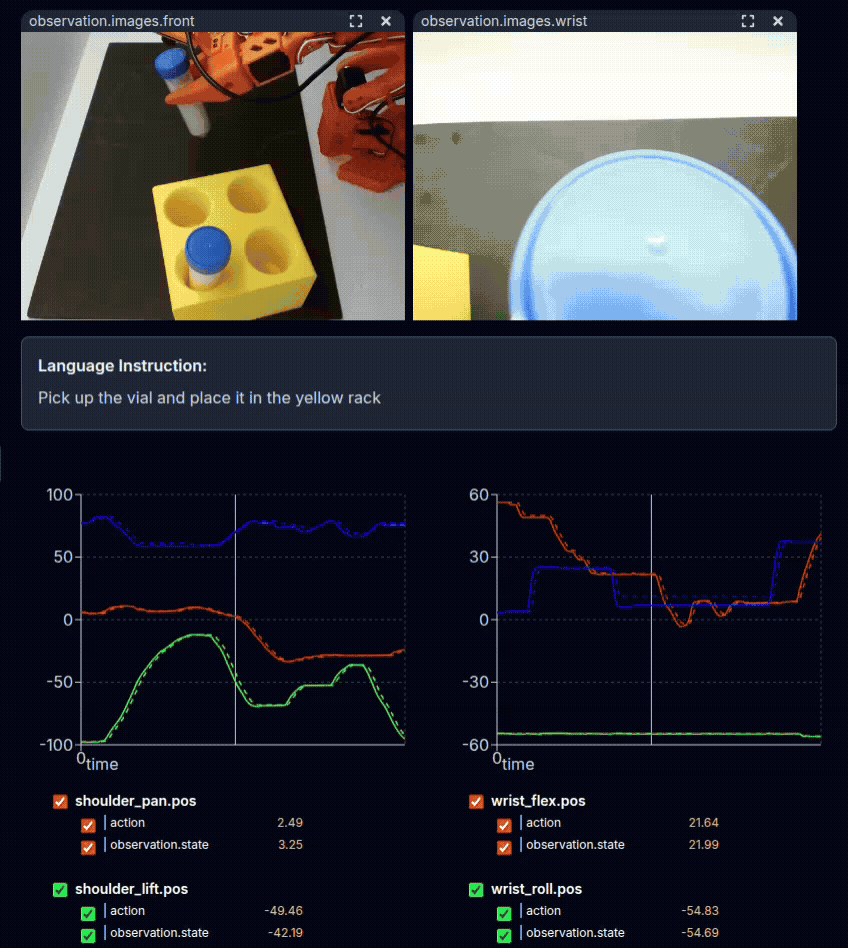

# Sim-to-Real Strategy 2: Co-Training With Real Data[#](#sim-to-real-strategy-2-co-training-with-real-data "Link to this heading")

What Do I Need for This Module?

Hands-on. You’ll need the calibrated SO-101 robot, teleop arm, both cameras, the assembled workspace, and the `real-robot` container.

In this session, you’ll learn the theory of co-training approaches and then deploy your first policy to the physical robot.

## Learning Objectives[#](#learning-objectives "Link to this heading")

By the end of this session, you’ll be able to:

- **Explain** co-training strategies for mixing sim and real data
- **Deploy** trained policies safely to the physical SO-101 robot
- **Observe** and document real-world policy behavior
- **Identify** initial sim-to-real gap symptoms

## What Is Co-Training?[#](#what-is-co-training "Link to this heading")

Co-training combines data from multiple sources—simulation and real-world—during policy training.

In our examples, we’ll show the power of combining a small amount of real demonstration data (5 episodes) with a much larger set of simulation demonstrations (70-100).

You’ll have a chance to experience policies trained with various mixes of data.

[](_images/real_demos_vial_rack.gif)

Physical demonstration of the task with teleoperation.[#](#id1 "Link to this image")

Tip

View a dataset of real-only demonstrations using the Hugging Face Dataset Visualizer [here](https://huggingface.co/spaces/lerobot/visualize_dataset?path=%2Fsreetz-nv%2Fso101_teleop_vials_rack_left_real_50%2Fepisode_0).

### The Data Challenge[#](#the-data-challenge "Link to this heading")

| Data Source | Quantity | Quality | Reality Match |
| --- | --- | --- | --- |
| **Simulation** | Abundant | Consistent | Approximate |
| **Real teleop** | Limited | Variable | Exact |

Neither source alone is ideal:

- **Sim-only**: Abundant but doesn’t match real-world distribution
- **Real-only**: Matches reality but quantity is limited

**Co-training** leverages both.

## (Optional) Collecting Real Demonstrations With LeRobot[#](#optional-collecting-real-demonstrations-with-lerobot "Link to this heading")

We will provide both a real dataset and a post-trained GR00T model trained on this sim+real dataset. But if you’d like, you can collect your own real demonstrations below.

Note

Since you’ll likely use our dataset / model, for now this section is a bit less detailed.

1. Run the `teleop-docker` container.
2. Log into the `hf` cli application: `hf auth login`
3. Set your Hugging Face username as an environment variable.

```
export HF\_USER=your-hf-username
```

4. Run the following command - make sure to set the `dataset.repo_id` argument.

```
lerobot-record \
--robot.type=so101\_follower \
--robot.port=$ROBOT\_PORT \
--robot.id=$ROBOT\_ID \
--robot.cameras='{
"wrist": {
"type": "opencv",
"index\_or\_path": '"$CAMERA\_GRIPPER"',
"width": 640,
"height": 480,
"fps": 30
},
"front": {
"type": "opencv",
"index\_or\_path": '"$CAMERA\_EXTERNAL"',
"width": 640,
"height": 480,
"fps": 30
}
}' \
--teleop.type=so101\_leader \
--teleop.port=$TELEOP\_PORT \
--teleop.id=$TELEOP\_ID \
--display\_data=true \
--dataset.repo\_id=${HF\_USER}/so101-teleop-vials-to-rack-real \
--dataset.num\_episodes=5 \
--dataset.single\_task="Pick up the vial and place it in the yellow rack" \
--play\_sounds=false
```

5. Use these controls to control recording:

- **Press Right Arrow (→):** Early stop the current episode or reset time and move to the next.
- **Press Left Arrow (←):** Cancel the current episode and re-record it.
- **Press Escape (ESC):** Immediately stop the session, encode videos, and upload the dataset.

Read more about LeRobot Record here: [lerobot-record](https://huggingface.co/docs/lerobot/il_robots#record-function)

6. Upload this dataset to the Hugging Face Hub: `hf upload ${HF_USER}/so101-teleop-vials-to-rack-real`
7. Merge this dataset with your simulation dataset.
8. Train GR00T on this merged dataset.

## Hands-On: Deploy Co-Trained Policy to Robot[#](#hands-on-deploy-co-trained-policy-to-robot "Link to this heading")

Now let’s deploy the **sim-and-real co-trained** policy to the physical robot—the same two-terminal GR00T server + client setup you used for sim and real evaluation earlier.

Tip

For hardware issues or unexpected policy behavior, consult the [Troubleshooting Guide](troubleshooting.html).

### What Policy Are We Running?[#](#what-policy-are-we-running "Link to this heading")

We use the **sim-and-real co-trained** checkpoint: trained on both simulation demonstrations and a small set of real teleoperation episodes. The exact `MODEL` (checkpoint path) is set in the commands below; you can change it to evaluate a different strategy or checkpoint.

### Workspace Prep[#](#workspace-prep "Link to this heading")

Review the [Safety](08-operating-so101.html#id1) protocol before proceeding.

1. **Verify** robot connection: `lerobot-find-port`
2. **Place** 1–3 vials randomly on the foam mat; position the rack in its designated location
3. **Ensure** cameras have clear view of workspace and clear any obstacles
4. **Turn on** the lightbox to suitable brightness (see [Building the Workspace](05-building-workspace.html#set-up-the-light) if needed)

### Running Policy Evaluation on the Real Robot[#](#running-policy-evaluation-on-the-real-robot "Link to this heading")

Throughout this course, when we run evaluations there will be two terminals involved:

1. The host terminal, where we start the GR00T container and policy server
2. The client terminal, where we run the evaluation rollout and control the robot

For real robot evaluation, the client is the physical robot.

### Terminal 1 (`real-robot` container) — Start the GR00T policy server[#](#terminal-1-real-robot-container-start-the-gr00t-policy-server "Link to this heading")

1. **Locate** the terminal already running the `real-robot` container.

If you can’t find it, click here to see the command to run the container.

If you don’t have the `real-robot` container terminal open, **open** a new terminal window (**CTRL+ALT+T**), and
run the docker `real-robot` container using:

```
cd ~/Sim-to-Real-SO-101-Workshop
xhost +
docker run -it --rm --name real-robot --network host --privileged --gpus all \
-e DISPLAY \
-v /dev:/dev \
-v /run/udev:/run/udev:ro \
-v $HOME/.Xauthority:/root/.Xauthority \
-v /tmp/.X11-unix:/tmp/.X11-unix \
-v ~/.cache/huggingface/lerobot/calibration:/root/.cache/huggingface/lerobot/calibration \
-v ./docker/env:/root/env \
-v ~/models:/workspace/models \
-v $(pwd)/docker/real/scripts:/Isaac-GR00T/gr00t/eval/real\_robot/SO100 \
real-robot \
/bin/bash
```

2. Inside this container, **run** the following. This is where we choose which model to evaluate (co-trained for Strategy 2).

```
export MODEL=aravindhs-NV/grootn16-finetune\_sreetz-so101\_teleop\_vials\_rack\_left\_sim\_and\_real/checkpoint-10000
```

4. **Run** the policy server with that model.

```
python Isaac-GR00T/gr00t/eval/run\_gr00t\_server.py \
--model-path /workspace/models/$MODEL
```

### Terminal 2 (`real-robot` container) — Evaluation rollout[#](#terminal-2-real-robot-container-evaluation-rollout "Link to this heading")

1. **Open** a second terminal. You will attach to the same `real-robot` container and run the robot client.
2. On the host, **attach** to the container you started in the last step:

```
docker exec -it real-robot /bin/bash
```

3. Inside the container, **run** the evaluation script:

```
python Isaac-GR00T/gr00t/eval/real\_robot/SO100/so101\_eval.py \
--robot.type=so101\_follower \
--robot.port="$ROBOT\_PORT" \
--robot.id="$ROBOT\_ID" \
--robot.cameras="{
wrist: {type: opencv, index\_or\_path: $CAMERA\_GRIPPER, width: 640, height: 480, fps: 30},
front: {type: opencv, index\_or\_path: $CAMERA\_EXTERNAL, width: 640, height: 480, fps: 30}
}" \
--policy\_host=localhost \
--policy\_port=5555 \
--lang\_instruction="Pick up the vial and place it in the yellow rack" \
--rerun True
```

Note

The `--rerun` flag is optional.

It adds Rerun into the loop for debugging, so you can see joint actions and the camera feeds while the policy is running. This lets you confirm the camera views are reasonable and the assignments are correct.

### Watching the Evaluation[#](#watching-the-evaluation "Link to this heading")

Watch the robot and the terminal during execution. The policy will run until you stop it or it completes the evaluation. Watch closely but stay clear; note any unexpected behavior and be ready to intervene.

**To stop the robot:** Press **CTRL+C** in Terminal 2 (robot client). The policy server in Terminal 1 keeps running.

**To run again:** Simply run the command again `python Isaac-GR00T/gr00t/eval/real_robot/SO100/so101_eval.py ...` in Terminal 2

**To switch model or fully restart:**

1. **Stop** both terminals’ commands (**CTRL+C**)
2. **Set** `MODEL` environment variable to the model you want to evaluate
3. **Restart** the commands for each terminal (model server, robot client)

Note

- At evaluation start, the robot will slowly rise to its initial pose, then enter into inference mode.
- At robot stop (CTRL+C), it will slowly drive itself back to its home pose.

Tip

Keep the policy server running between evaluation attempts. Only restart it if you want to load a different model checkpoint.

## Key Takeaways[#](#key-takeaways "Link to this heading")

- Co-training combines sim and real data for better policies
- Safety is paramount when deploying to real hardware
- Document observations systematically—they guide improvement
- The sim-to-real gap is real and often significant
- Different policies exhibit different failure modes

## Resources[#](#resources "Link to this heading")

- [Isaac-GR00T Repository](https://github.com/NVIDIA/Isaac-GR00T) — Source code for GR00T deployment including SO-101 evaluation scripts
- [SO-101 Finetuning Guide](https://github.com/NVIDIA/Isaac-GR00T/blob/main/examples/SO100/README.md) — Full instructions for finetuning and evaluation
- [Sim-and-Real Co-Training: A Simple Recipe for Vision-Based Robotic Manipulation](https://co-training.github.io/) — RSS 2025 paper on co-training strategies

## What’s Next?[#](#what-s-next "Link to this heading")

Let’s try another strategy to address the sim-to-real gap. In the next session, [Sim-to-Real Strategy 3: Augmenting with Cosmos](14-strategy3-cosmos.html), you’ll learn about synthetic data augmentation using Cosmos Transfer 2.5.

On this page
