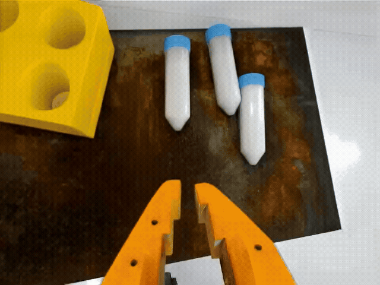

# Sim-to-Real Strategy 3: Augmenting Datasets With Cosmos[#](#sim-to-real-strategy-3-augmenting-datasets-with-cosmos "Link to this heading")

What Do I Need for This Module?

Hands-on. You’ll need the calibrated SO-101 robot, both cameras, the assembled workspace, and the `real-robot` container.

In this session, you’ll learn how Cosmos can create diverse synthetic training data and deploy Cosmos-augmented policies to the real robot.

## Learning Objectives[#](#learning-objectives "Link to this heading")

By the end of this session, you’ll be able to:

- **Explain** how Cosmos and world models generate synthetic robot data
- **Deploy** policies trained with Cosmos augmentation
- **Compare** performance across different training data strategies

## Beyond Domain Randomization and Co-Training[#](#beyond-domain-randomization-and-co-training "Link to this heading")

In Strategy 1, you used domain randomization to vary simulation parameters. This is effective, but limited:

- Only varies what you explicitly randomize
- Simulation rendering still looks “synthetic”
- Can’t generate truly novel scenarios

**Cosmos** addresses these limitations through generative modeling.

## What Is Cosmos?[#](#what-is-cosmos "Link to this heading")

Cosmos is NVIDIA’s world foundation model for physical AI. It can:

- **Generate** realistic video sequences from prompts or initial frames
- **Simulate** plausible physical interactions
- **Augment** robot training data with diverse synthetic scenarios

### How Cosmos Works[#](#how-cosmos-works "Link to this heading")

```
Input: Robot demonstration video + prompt
"Same task, different lighting, different vial positions"
Cosmos generates: Multiple variations of the scenario
with consistent physics and new visual appearance
Output: Augmented training data with diverse conditions
```

Prompt:

```
prompt: Photorealistic first-person view from a robotic arm's orange claw-like gripper. The prongs are visible at the bottom edge, hovering over a heavily corroded, textured rusty steel plate showing oxidation and wear mat. To the left is a yellow rectangular vial rack; to the right, two white opaque centrifuge tubes with blue caps, filled with a white substance, lie horizontally. Plain white wall background with {bright, diffused clinical LED lighting. Sharp macro focus, realistic plastic finishes, and fluid mechanical motion.
{
"name": "so101",
"prompt\_path": "prompt\_test2.txt",
"video\_path": "ego\_rgb\_001.mp4",
"guidance": 3,
"depth": {
"control\_weight": 0.2,
"control\_path": "ego\_depth\_001.mp4"
},
"edge": {
"control\_weight": 1.0
},
"seg": {
"control\_weight": 0.3,
"control\_path": "ego\_instance\_id\_segmentation\_001.mp4"
},
"vis": {
"control\_weight": 0.1
}
}
```

[](_images/cosmos-augment-1.gif)

Cosmos Augmentation Example 1[#](#id1 "Link to this image")

### Key Capabilities[#](#key-capabilities "Link to this heading")

**Visual Diversity**

- Photorealistic rendering variations
- Natural lighting changes
- Background and texture diversity

**Scenario Variation**

- Object position changes
- Different object instances
- Environmental modifications

**Physical Consistency**

- Maintains plausible physics
- Preserves task structure
- Coherent object interactions

## Hands-On: Using Cosmos-Augmented Data[#](#hands-on-using-cosmos-augmented-data "Link to this heading")

We’ve pre-generated Cosmos-augmented datasets for this learning path.

Compare to the DR-augmented data:

- Notice the visual difference in rendering
- Observe lighting and texture variations
- Check for physical plausibility

## Policies to Evaluate[#](#policies-to-evaluate "Link to this heading")

Deploy a policy trained with Cosmos-augmented data using the same two-terminal GR00T server + client setup as in [Strategy 2](13-strategy2-cotraining.html) and [Real Evaluation](12-real-evaluation.html).

Tip

See the [Troubleshooting Guide](troubleshooting.html) for help with deployment issues.

### What Policy Are We Running?[#](#what-policy-are-we-running "Link to this heading")

We have two Cosmos-augmented policies to test. Set `MODEL` in Terminal 1 to the checkpoint you want to evaluate:

| Training Data Mix | Visualize Dataset | Model Checkpoint |
| --- | --- | --- |
| 75 sim episodes + 7 Cosmos-augmented episodes | [visualize on Hugging Face](https://huggingface.co/spaces/lerobot/visualize_dataset?path=%2Fsreetz-nv%2Fso101_teleop_vials_rack_left_augment_02%2Fepisode_75) | [aravindhs-NV/sreetz-so101\_teleop\_vials\_rack\_left\_augment\_02/](https://huggingface.co/aravindhs-NV/sreetz-so101_teleop_vials_rack_left_augment_02) |
| 75 sim episodes + 70 Cosmos-augmented episodes | [visualize on Hugging Face](https://huggingface.co/spaces/lerobot/visualize_dataset?path=%2Fsreetz-nv%2Fso101_teleop_vials_rack_left_cosmos_70%2Fepisode_75) | [aravindhs-NV/so100-orig-groot-vials-rack-left-cosmos-70](https://huggingface.co/aravindhs-NV/so100-orig-groot-vials-rack-left-cosmos-70) |

### Workspace Prep[#](#workspace-prep "Link to this heading")

Same as Strategy 2: verify robot connection, place vials and rack, ensure cameras have a clear view, turn on the lightbox. See [Building the Workspace](05-building-workspace.html), [Strategy 2: Workspace prep](13-strategy2-cotraining.html#workspace-prep), and [Real Evaluation: Workspace prep](12-real-evaluation.html#id1).

### Running Policy Evaluation on the Real Robot[#](#running-policy-evaluation-on-the-real-robot "Link to this heading")

Throughout this course, when we run evaluations there will be two terminals involved:

1. The host terminal, where we start the GR00T container and policy server
2. The client terminal, where we run the evaluation rollout and control the robot

For real robot evaluation, the client is the physical robot.

### Terminal 1 (`real-robot` container) — Start the GR00T policy server[#](#terminal-1-real-robot-container-start-the-gr00t-policy-server "Link to this heading")

1. **Locate** the terminal already running the `real-robot` container.

If you can’t find it, click here to see the command to run the container.

If you don’t have the `real-robot` container terminal open, **open** a new terminal window (**CTRL+ALT+T**), and
run the docker `real-robot` container using:

```
cd ~/Sim-to-Real-SO-101-Workshop
xhost +
docker run -it --rm --name real-robot --network host --privileged --gpus all \
-e DISPLAY \
-v /dev:/dev \
-v /run/udev:/run/udev:ro \
-v $HOME/.Xauthority:/root/.Xauthority \
-v /tmp/.X11-unix:/tmp/.X11-unix \
-v ~/.cache/huggingface/lerobot/calibration:/root/.cache/huggingface/lerobot/calibration \
-v ./docker/env:/root/env \
-v ~/models:/workspace/models \
-v $(pwd)/docker/real/scripts:/Isaac-GR00T/gr00t/eval/real\_robot/SO100 \
real-robot \
/bin/bash
```

2. Inside this container, **run** the following. Set `MODEL` to the Cosmos-augmented checkpoint you want to test (e.g. 75+70 Cosmos).

```
export MODEL=aravindhs-NV/so100-orig-groot-vials-rack-left-cosmos-70
```

3. **Run** the policy server with that model.

```
python Isaac-GR00T/gr00t/eval/run\_gr00t\_server.py \
--model-path /workspace/models/$MODEL
```

### Terminal 2 (`real-robot` container) — Evaluation rollout[#](#terminal-2-real-robot-container-evaluation-rollout "Link to this heading")

Open a second terminal. You will attach to the same `real-robot` container and run the robot client.

1. On the host, **attach** to the container:

```
docker exec -it real-robot /bin/bash
```

2. Inside the container, **run** the evaluation script:

```
python Isaac-GR00T/gr00t/eval/real\_robot/SO100/so101\_eval.py \
--robot.type=so101\_follower \
--robot.port="$ROBOT\_PORT" \
--robot.id="$ROBOT\_ID" \
--robot.cameras="{
wrist: {type: opencv, index\_or\_path: $CAMERA\_GRIPPER, width: 640, height: 480, fps: 30},
front: {type: opencv, index\_or\_path: $CAMERA\_EXTERNAL, width: 640, height: 480, fps: 30}
}" \
--policy\_host=localhost \
--policy\_port=5555 \
--lang\_instruction="Pick up the vial and place it in the yellow rack" \
--rerun True
```

Note

The `--rerun` flag is optional.

It adds Rerun into the loop for debugging, so you can see joint actions and the camera feeds while the policy is running. This lets you confirm the camera views are reasonable and the assignments are correct.

### Watching the Evaluation[#](#watching-the-evaluation "Link to this heading")

Watch the robot and the terminal during execution. Compare behavior to the sim-only and co-trained policies: Cosmos-augmented policies may show different robustness to lighting and visual variation.

**To stop the robot:** Press **CTRL+C** in Terminal 2 (robot client). The policy server in Terminal 1 keeps running.

**To run again:** Simply run the command again `python Isaac-GR00T/gr00t/eval/real_robot/SO100/so101_eval.py ...` in Terminal 2

**To switch model or fully restart:**

1. **Stop** both terminals’ commands (**CTRL+C**)
2. **Set** `MODEL` environment variable to the model you want to evaluate
3. **Restart** the commands for each terminal (model server, robot client)

### To Try the Other Policy Trained on Cosmos-Augmented Data[#](#to-try-the-other-policy-trained-on-cosmos-augmented-data "Link to this heading")

1. In terminal 1, **press CTRL+C** to stop the policy server.
2. In terminal 2, **press CTRL+C** to stop the robot client.
3. **Set** `MODEL` environment variable to the model you want to evaluate.

```
export MODEL=aravindhs-NV/sreetz-so101\_teleop\_vials\_rack\_left\_augment\_02/checkpoint-10000
```

4. **Restart** the policy server by running the same command again.

```
python Isaac-GR00T/gr00t/eval/run\_gr00t\_server.py --model-path /workspace/models/$MODEL
```

5. **Run** the robot client again by running the same command again.

```
python Isaac-GR00T/gr00t/eval/real\_robot/SO100/so101\_eval.py \
--robot.type=so101\_follower \
--robot.port="$ROBOT\_PORT" \
--robot.id="$ROBOT\_ID" \
--robot.cameras="{
wrist: {type: opencv, index\_or\_path: $CAMERA\_GRIPPER, width: 640, height: 480, fps: 30},
front: {type: opencv, index\_or\_path: $CAMERA\_EXTERNAL, width: 640, height: 480, fps: 30}
}" \
--policy\_host=localhost \
--policy\_port=5555 \
--lang\_instruction="Pick up the vial and place it in the yellow rack" \
--rerun True
```

Note

- At evaluation start, the robot will slowly rise to its initial pose, then enter into inference mode.
- At robot stop (**CTRL+C**), it will slowly drive itself back to its home pose.

Tip

Keep the policy server running between evaluation attempts. Only restart it when you want to load a different model checkpoint.

### Comparing Policies[#](#comparing-policies "Link to this heading")

After running the Cosmos-augmented policy, compare with your notes from Strategy 2 (co-trained) and your earlier real evaluation baseline (sim-only policy). Note whether Cosmos augmentation improves consistency, grasp success, or placement accuracy on the real robot.

## Key Takeaways[#](#key-takeaways "Link to this heading")

- Cosmos generates photorealistic synthetic data beyond DR capabilities
- Different approaches address different aspects of the sim-to-real gap
- Combining strategies often works better than any single approach
- Visual diversity from Cosmos can unlock performance gains

## Resources[#](#resources "Link to this heading")

- [Cosmos Transfer 2.5](https://research.nvidia.com/labs/dir/cosmos-transfer2.5/) — NVIDIA Research page on Cosmos video-to-video transfer capabilities
- [Cosmos Cookbook](https://nvidia-cosmos.github.io/cosmos-cookbook/) — Recipes and examples for Cosmos world foundation models

## What’s Next?[#](#what-s-next "Link to this heading")

We have not measured or addressed the actuation gap. In the next session, [Sim-to-Real Strategy 4: SAGE + GapONet](15-strategy4-sage.html), you’ll learn to systematically measure and close the actuation gap.

On this page
