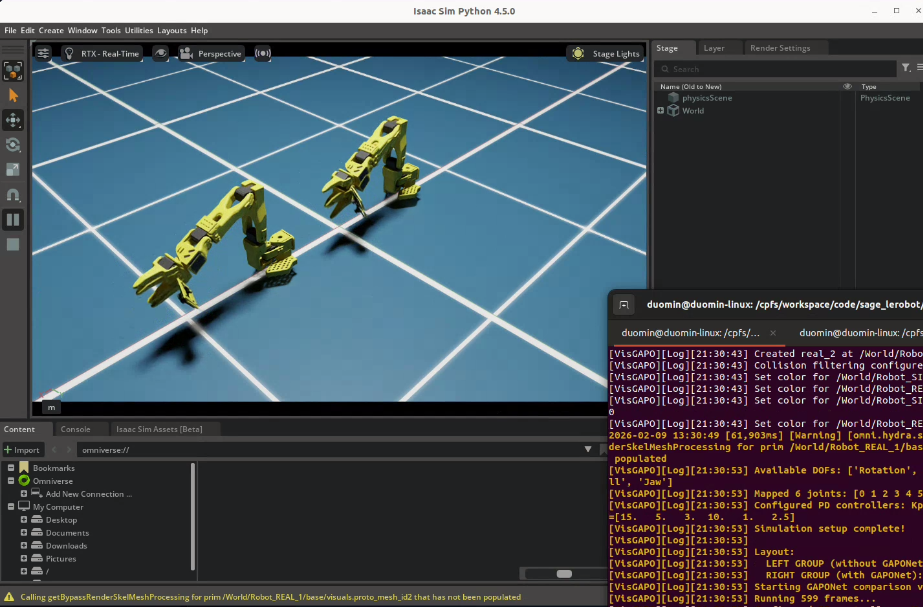
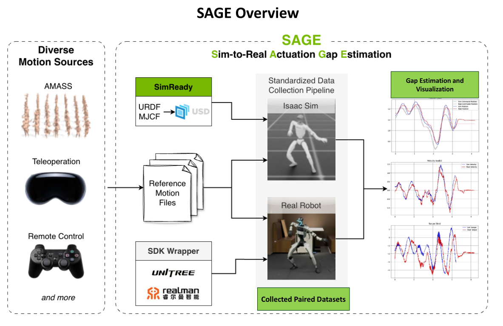
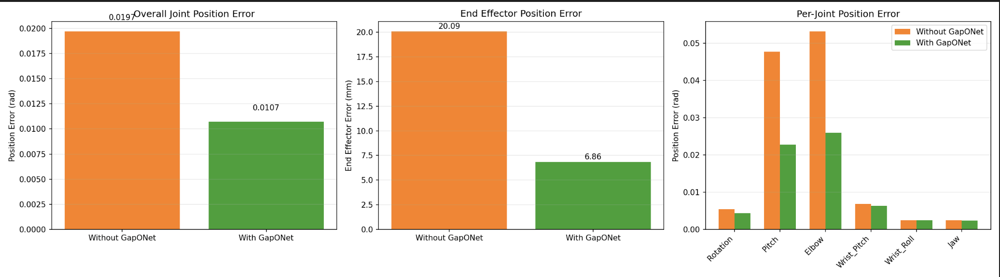
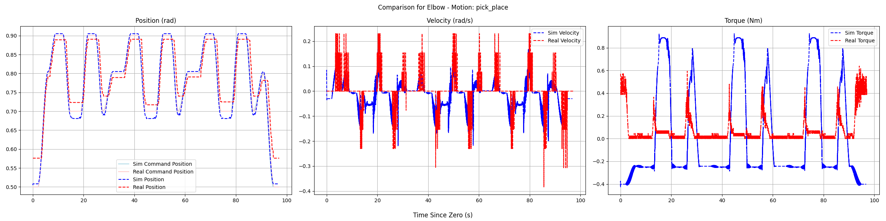
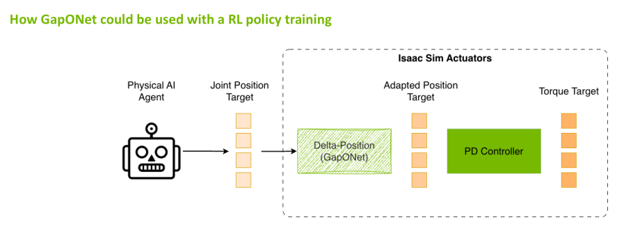

# Sim-to-Real Strategy 4: Measuring and Closing the Gap With SAGE + GapONet[#](#sim-to-real-strategy-4-measuring-and-closing-the-gap-with-sage-gaponet "Link to this heading")

[](_images/sage-gaponet-comparison-feb9-model.png)

SAGE GapONet Comparison[#](#id1 "Link to this image")

In this session, you’ll learn how to quantify the actuation gap precisely using SAGE, and how GapONet can model complex actuation dynamics that aren’t captured by simple parameter tuning.

## Learning Objectives[#](#learning-objectives "Link to this heading")

By the end of this session, you’ll be able to:

- **Explain** how SAGE quantifies the sim-to-real gap per joint
- **Interpret** SAGE analysis results to guide improvement
- **Describe** how GapONet models complex actuation dynamics

## The Problem: Unknown Gap Sources[#](#the-problem-unknown-gap-sources "Link to this heading")

You’ve seen the improvements made by these strategies so far:

- Domain randomization (Strategy 1)
- Co-training with real data (Strategy 2)
- Cosmos augmentation (Strategy 3)

But we haven’t addressed actuation gaps yet. To close them systematically, let’s first understand some of the sources:

### Sources of the Sim-to-Real Gap[#](#sources-of-the-sim-to-real-gap "Link to this heading")

**During Sensing:**

- Simplified or inaccurate sensor models for cameras
- Physics modeling gaps in the simulator

**During Actuation:**

- Inaccurate or missing actuator models
- Physics modeling gaps (contact nuances, friction, closed-loop linkages)
- Uncharacterized dynamic effects at system level (changing inertial behavior with payload, varying friction)
- Inaccurate URDF (missing component details, missing properties, user input error)
- CAD → URDF → USD format conversion errors

To close these gaps, you need to know:

- **Where** exactly are the gaps?
- **How large** are they?
- **What causes** them?

Specifically for the SO-101, one challenge is that the actuators are hobby servos that can introduce significant backlash into the system, and this backlash adds up through the kinematic chain of the robot.

SAGE can help us visualize and collect data related to this gap.

## What Is SAGE?[#](#what-is-sage "Link to this heading")

**SAGE** (Sim-to-Real Actuation Gap Estimation) is a collaborative project by Tongji University (TJU), Peking University (PKU), and NVIDIA to demonstrate an approach for sim-to-real gap perception, measurement, and bridging.

SAGE provides a systematic way of collecting real and sim paired datasets, analyzing, estimating, and visualizing the sim-to-real gap.

**Repository**: [isaac-sim2real/sage](https://github.com/isaac-sim2real/sage)

SAGE systematically:

1. **Collects** paired real and simulation data for the same motions
2. **Compares** position, velocity, and torque across domains
3. **Quantifies** the gap per joint
4. **Visualizes** where the gap is largest
5. **Enables** targeted improvement via GapONet or parameter tuning

[](_images/sage-overview.png)

SAGE pipeline overview: from diverse motion sources through gap estimation to gap bridging.[#](#id2 "Link to this image")

### SAGE Workflow[#](#sage-workflow "Link to this heading")

```
┌─────────────────┐ ┌─────────────────┐
│ Motion Files │ │ Real Robot │
│ (retargeted │────▶│ Data Collection│
│ sequences) │ │ (pos, vel, τ) │
└─────────────────┘ └────────┬────────┘
│
▼
┌─────────────────┐ ┌─────────────────┐
│ Same Motions │ │ Simulation │
│ in Isaac Sim │────▶│ Data Collection│
│ │ │ (pos, vel, τ) │
└─────────────────┘ └────────┬────────┘
│
▼
┌─────────────────┐
│ Gap Analysis │
│ Per-Joint │
│ Visualization │
└────────┬────────┘
│
▼
┌─────────────────┐
│ Gap Bridging │
│ (GapONet, etc.)│
└─────────────────┘
```

### Case Study: SO-101 SAGE Pipeline Overview[#](#case-study-so-101-sage-pipeline-overview "Link to this heading")

The following gives you an intuitive overview of the full pipeline; the step-by-step walkthrough comes later in this document.

**Pipeline in brief.** For the SO-101 we (1) collect sim data, (2) collect real robot data, and (3) train a gap-bridging model (GapONet; its details are covered later). Our SO-101 setup collected 8 hours of real trajectory data for such training.

[](_images/so101_data_collection.gif)

SO-101 during real-robot data collection.[#](#id3 "Link to this image")

Below we show two ways to see the effect of GapONet after it is trained.

**1. Visual comparison in the simulation environment.**  
In Isaac Sim we overlay real-robot motion with sim replay. The GUI screenshot below shows: **top** — real result vs sim *without* GapONet; **bottom** — real result vs sim *with* GapONet. With GapONet, the sim trace matches the real motion much more closely.

[](_images/sage-gaponet-comparison-feb9-model.png)

Top: real vs sim without GapONet. Bottom: real vs sim with GapONet.[#](#id4 "Link to this image")

**2. Quantitative joint-level error.**  
We measure error between real and sim at each joint. In the plot below, **orange** is the error for real vs sim *without* GapONet; **green** is the error for real vs sim *with* GapONet. Lower green bars show that GapONet reduces the gap.

[](_images/sage_new_dataset_results.png)

Joint error: orange = real vs sim without GapONet; green = real vs sim with GapONet.[#](#id5 "Link to this image")

## SAGE Repository Structure[#](#sage-repository-structure "Link to this heading")

Understanding the file layout helps navigate the framework. See the [SAGE repository](https://github.com/isaac-sim2real/sage) for the current structure; a simplified overview:

```
sage/
├── assets/ # Robot USD files
│ └── {robot\_name}/
├── configs/
│ ├── {robot\_name}\_joints.yaml # Complete joint list
│ └── {robot\_name}\_valid\_joints.txt # Motion-relevant joints
├── docs/ # Robot-specific guides (e.g. LEROBOT\_REAL for SO-101)
├── motion\_files/
│ └── {robot\_name}/{source}/ # Retargeted motion files
├── output/
│ ├── sim/{robot\_name}/{source}/{motion\_name}/ # Simulation results
│ └── real/{robot\_name}/{source}/{motion\_name}/ # Real robot results
├── sage/ # Python package
│ ├── assets.py # Robot configuration (USD path, PD gains, etc.)
│ ├── simulation.py # Isaac Sim simulation code
│ ├── analysis.py # Sim vs. real comparison and metrics
│ ├── real\_unitree/ # Unitree H1-2 real robot code
│ ├── real\_realman/ # Realman WR75S real robot code
│ └── real\_so101/ # LeRobot SO-101 real robot code
└── scripts/
├── run\_simulation.py # Run simulation data collection
├── run\_analysis.py # Compare sim vs real, generate metrics and plots
└── run\_real.py # Run real robot data collection
```

## Walkthrough: Running SAGE on an Action Sequence in Simulation[#](#walkthrough-running-sage-on-an-action-sequence-in-simulation "Link to this heading")

This walkthrough demonstrates the complete SAGE pipeline: running the same motion in simulation and on real hardware, then analyzing the gap.

Important

This walkthrough is for reference; we won’t be doing this hands-on today for time.

### Startup[#](#startup "Link to this heading")

1. First, **clone** the SAGE repository:

```
git clone git@github.com:isaac-sim2real/sage.git
cd sage
```

2. **Start** the SAGE container:

```
xhost +
docker run --name isaac-lab --entrypoint bash -it --gpus all -e "ACCEPT\_EULA=Y" --rm --network=host \
-e "PRIVACY\_CONSENT=Y" \
-e DISPLAY \
-v /tmp/.X11-unix:/tmp/.X11-unix \
-v $HOME/.Xauthority:/root/.Xauthority \
-v ~/docker/isaac-sim/cache/kit:/isaac-sim/kit/cache:rw \
-v ~/docker/isaac-sim/cache/ov:/root/.cache/ov:rw \
-v ~/docker/isaac-sim/cache/pip:/root/.cache/pip:rw \
-v ~/docker/isaac-sim/cache/glcache:/root/.cache/nvidia/GLCache:rw \
-v ~/docker/isaac-sim/cache/computecache:/root/.nv/ComputeCache:rw \
-v ~/docker/isaac-sim/logs:/root/.nvidia-omniverse/logs:rw \
-v ~/docker/isaac-sim/data:/root/.local/share/ov/data:rw \
-v ~/docker/isaac-sim/documents:/root/Documents:rw \
-v $(pwd):/app:rw \
sage
```

### Choose Motion File[#](#choose-motion-file "Link to this heading")

Motion files contain retargeted action sequences. SAGE supports diverse motion sources:

- **Teleoperation**: Human-guided motions
- **Remote control**: Joystick or keyboard controlled
- **Retargeted motions**: From motion capture or other robots

For SO-101, motion files live under `motion_files/so101/custom/`, including pick-and-place and other trajectories:

```
# Motion files location
ls motion\_files/so101/custom/
# Example output (subset):
# actuator\_bandwidth.txt
# pick\_place.txt
# oscillation\_low\_freq.txt
# random\_waypoints.txt
# ...
```

Each `.txt` file contains joint angle positions over time (format: first line joint names, then comma-separated angles in radians per line).

### Verify the Robot Configuration[#](#verify-the-robot-configuration "Link to this heading")

Verifying robot configuration in `sage/assets.py`:

```
1# SO-101 entry in ROBOT\_CONFIGS
2"so101": {
3 "usd\_path": "assets/so101/SO-ARM101-USD.usd",
4 "offset": (0.0, 0.0, 0.0),
5 "default\_kp": 100.0, # PD controller stiffness
6 "default\_kd": 2.0, # PD controller damping
7 "default\_control\_freq": 50.0, # Control frequency (Hz)
8}
```

Verifying the valid joints list:

```
cat configs/so101\_valid\_joints.txt
# Example output:
# Rotation
# Pitch
# Elbow
# Wrist\_Pitch
# Wrist\_Roll
# Jaw
```

### Run Simulation Data Collection[#](#run-simulation-data-collection "Link to this heading")

From within the same terminal in the SAGE container, we’d now execute the motion sequence in Isaac Sim:

```
${ISAACSIM\_PATH}/python.sh scripts/run\_simulation.py \
--robot-name so101 \
--motion-source custom \
--motion-files motion\_files/so101/custom/pick\_place.txt \
--valid-joints-file configs/so101\_valid\_joints.txt \
--output-folder output \
--fix-root \
--physics-freq 200 \
--render-freq 200 \
--control-freq 50 \
--kp 100 \
--kd 2
```

This collects:

- Commanded joint positions
- Actual joint positions (from simulation)
- Joint velocities
- Joint torques

### Run Real Robot Data Collection[#](#run-real-robot-data-collection "Link to this heading")

Now to create a paired dataset, we’ll execute the same motion on the physical SO-101. This will actually move the robot and record data.

Follow the instructions here:
[LEROBOT\_REAL.md](https://github.com/isaac-sim2real/sage/blob/main/docs/LEROBOT_REAL.md)

### Analyze the Gap[#](#analyze-the-gap "Link to this heading")

Compare the paired sim-real data:

```
python scripts/run\_analysis.py \
--robot-name so101 \
--motion-source custom \
--motion-names "pick\_place" \
--output-folder output \
--valid-joints-file configs/so101\_valid\_joints.txt
```

[](_images/sage-elbow-axis-analysis.png)

Analysis of SAGE data to quantify the gap for a given axis, and a given motion.[#](#id6 "Link to this image")

## Using Paired Data for Gap Bridging[#](#using-paired-data-for-gap-bridging "Link to this heading")

Once you have sim-real paired data, you can train a neural network that bridges the actuation gap. This gap-bridging model can be used in two ways:

**1. Integrate into the simulation environment.**  
Use the model inside sim so that the environment better matches real actuation. Policies trained in this gap-corrected sim are more likely to achieve seamless sim-to-real deployment. The figure below illustrates this use.

**2. Use at real-robot deployment.**  
Apply the model on the real robot at inference time so that the policy’s actions are corrected for the actuation gap before execution. This is the idea behind the future work on GapONet + GR00T integration: a policy trained in sim benefits from gap bridging when deployed on hardware.

[](_images/sage-use-in-training.png)

Using a gap-bridging model inside the simulation environment so that policies are trained with more realistic actuation.[#](#id7 "Link to this image")

## What Is GapONet?[#](#what-is-gaponet "Link to this heading")

**GapONet**, developed by Peking University (PKU), learns a neural network model of actuator behavior that captures effects not easily modeled analytically. GapONet is part of the SAGE ecosystem, and its integration in SAGE is in progress.

### How GapONet Works[#](#how-gaponet-works "Link to this heading")

```
Training Phase:
Input: Commanded action sequences (from motions)
Target: Actual resulting motion (from real robot)
Learns: Mapping from command → actual behavior
Inference Phase:
Input: Policy's intended action
Output: Compensated action that achieves intended behavior
```

### Training GapONet[#](#training-gaponet "Link to this heading")

Note

This section is for reference; we won’t be doing this training hands-on today for time.

The [GapONet repository](https://github.com/jiemingcui/gaponet) provides an Isaac Lab–based implementation with DeepONet, Transformer, and MLP architectures for sim-to-real humanoid control. After installing the repo and required assets (see the repo README), train with the operator environment:

```
python scripts/rsl\_rl/train.py --task Isaac-Humanoid-Operator-Delta-Action \
--num\_envs=4080 --max\_iterations 100000 --experiment\_name Sim2Real \
--letter amass --run\_name delta\_action\_mlp\_payload --device cuda env.mode=train --headless
```

Adjust `--num_envs`, `--max_iterations`, and `--run_name` as needed. For other architectures or tasks, see the repo’s [Usage](https://github.com/jiemingcui/gaponet#usage) and [Adding a New Robot](https://github.com/jiemingcui/gaponet#adding-a-new-robot) sections.

**Evaluation and export.** Evaluate a checkpoint:

```
python scripts/rsl\_rl/play.py --task Isaac-Humanoid-Operator-Delta-Action \
--model ./model/model\_17950.pt --num\_envs 20 --headless
```

Export to JIT for lightweight inference without Isaac Sim:

```
python scripts/rsl\_rl/inference\_jit.py \
--export \
--checkpoint ./model/model\_17950.pt \
--task Isaac-Humanoid-Operator-Delta-Action \
--output ./model/policy.pt \
--device cuda:0 \
--num\_envs 20
```

Then run inference on test data (no Isaac Sim required):

```
python scripts/rsl\_rl/deploy.py \
--model ./model/policy.pt \
--test\_data ./source/sim2real/sim2real/tasks/humanoid\_operator/motions/motion\_amass/edited\_27dof/test.npz
```

For SO-101 or other arms, SAGE’s gap-bridging training typically focuses on joints with the largest sim-to-real gaps (e.g. gripper, wrist) using paired SAGE data; the exact scripts depend on the [SAGE repository](https://github.com/isaac-sim2real/sage) and any GapONet integration there.

## Pre-Collected Dataset[#](#pre-collected-dataset "Link to this heading")

For humanoid research, SAGE provides pre-collected datasets:

**Unitree Dataset** (H1-2 humanoid):

- Upper-body motions under varying payloads (0-3 kg)
- Motions adapted from AMASS dataset
- Paired sim-real data

**RealMan Dataset** (WR75S arms):

- Four arms tested under four payload conditions
- Cross-robot generalization studies

The PKU Disk link for downloading these datasets is in the SAGE repository’s [Processed Sim2Real Datasets](https://github.com/isaac-sim2real/sage#processed-sim2real-datasets) section.

## Community-Driven Future[#](#community-driven-future "Link to this heading")

SAGE is designed to become a community-driven effort where roboticists around the world come together to collectively work on solutions.

**Community Contributions:**

- **Paired datasets**: Real-sim motion data for new robots and tasks
- **Sim-Ready assets**: Robot USD files calibrated for accurate simulation
- **Novel NN architectures**: New models for gap estimation and compensation
- **Hybrid solutions**: Combinations of analytical and learned approaches

**Planned Community Features:**

- **Leaderboards**: Rank trained networks by quality, enabled task space, and robot models
- **OEM Feedback**: Guide humanoid manufacturers in improving their assets and APIs

Contributing your own data and models helps the entire robotics community close the sim-to-real gap faster.

## Future Work: GapONet + GR00T Integration[#](#future-work-gaponet-gr00t-integration "Link to this heading")

A key next step is integrating GapONet inference directly into the GR00T deployment loop for our SO-101 task:

```
GR00T Policy → Action Command → GapONet Compensation → Robot Execution
```

This would allow the VLA policy to output its intended actions while GapONet automatically compensates for actuator dynamics in real-time—combining the generalization of foundation models with the precision of learned actuator models.

This integration is under active development.

## Key Takeaways[#](#key-takeaways "Link to this heading")

- SAGE provides quantitative, per-joint gap analysis
- The pipeline: same motion → sim + real → compare → quantify
- Knowing where gaps are enables targeted improvement
- Small gaps: tune parameters; large gaps: use GapONet
- GapONet models complex dynamics that resist simple tuning
- Isaac Lab integration enables direct use in simulation workflows

## Resources[#](#resources "Link to this heading")

- **SAGE Repository**: [isaac-sim2real/sage](https://github.com/isaac-sim2real/sage)
- **GapONet Repository**: [jiemingcui/gaponet](https://github.com/jiemingcui/gaponet)

## What’s Next?[#](#what-s-next "Link to this heading")

Continue to the [Conclusion](16-conclusion.html) for a summary of what you’ve learned and next steps.

On this page
