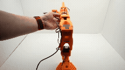
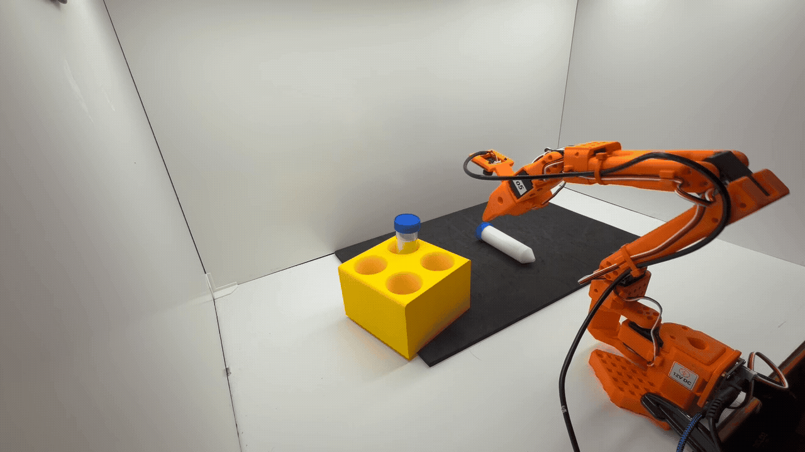

# Train an SO-101 Robot From Sim-to-Real With NVIDIA Isaac[#](#train-an-so-101-robot-from-sim-to-real-with-nvidia-isaac "Link to this heading")

Welcome to this hands-on learning path. The material is organized into **self-paced sections** you can work through in order. Duration depends on how deeply you run each exercise and whether you collect your own simulation data.

## Overview[#](#overview "Link to this heading")

You’ll train and deploy a vision-language-action (VLA) model to perform **unstructured pick-and-place of centrifuge vials** into a rack using an SO-101 robot arm - first in sim, where we can iterate quickly and validate behavior, then in reality.

Through this workflow you’ll experience the **sim-to-real gap** firsthand and how to apply systematic strategies to close it.

Robot Calibration

Domain Randomization

Sim Teleoperation

Data Collection

Cosmos Augmentation

Real Robot Autonomous Tests

## Learning Objectives[#](#learning-objectives "Link to this heading")

By the end of this learning path, you’ll be able to:

- **Configure** and calibrate an SO-101 robot for sim-to-real experiments
- **Collect** demonstration data using teleoperation and augment with domain randomization
- **Train** vision-language-action (VLA) models using GR00T for robot manipulation
- **Evaluate** trained policies in simulation
- **Deploy** policies to physical robots and observe the sim-to-real gap
- **Apply** four sim-to-real strategies: Domain Randomization, Co-training, Cosmos Augmentation, and SAGE+GapONet (actuator gap estimation)

On this page
