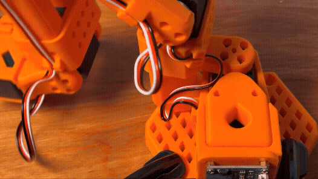

# Troubleshooting Guide[#](#troubleshooting-guide "Link to this heading")

This page consolidates troubleshooting information from across this learning path for easy access.

This learning path uses Docker for teleoperation in sim, real-robot evaluation, and GR00T inference.

Commands such as `lerobot-find-port` and `lerobot-find-cameras opencv` are run inside the `teleop-docker` container.

GR00T inference and real-robot evaluation are run inside the `real-robot` container.

## Hardware Issues[#](#hardware-issues "Link to this heading")

### First Thing to Try[#](#first-thing-to-try "Link to this heading")

Unplug power, and replug the power cable. Do this 2X if the next command doesn’t run. If that doesn’t solve, proceed to the next steps.

Robot Doesn’t Respond

1. **Check** USB connection
2. **Verify** power LED is on
3. **Try** a different USB port
4. Inside the `teleop-docker` container, **run** `lerobot-find-port` to confirm the port is correct.

No Ports Found or Permission Denied on /dev/ttyACM\*

If `lerobot-find-port` finds no ports, or you see permission denied when accessing the robot:

1. **Close** terminals.
2. **Open** a new terminal window (**CTRL+ALT+T**).
3. **Grant** read/write access to the serial ports (update device paths to match your assigned ports):

```
sudo chmod 666 /dev/ttyACM0
sudo chmod 666 /dev/ttyACM1
sudo chmod 666 /dev/ttyACM2
sudo chmod 666 /dev/ttyACM3
```

Permissions reset when devices are reconnected; re-run these after unplugging/replugging USB if needed.

4. **Permanent fix:** add your user to the `dialout` group (and optionally `tty` and `video` for cameras), then log out and back in:

```
sudo usermod -a -G dialout "$USER"
sudo usermod -a -G tty "$USER"
sudo usermod -a -G video "$USER"
```

Power Not Connected (All Motors Missing)

If you see this error showing all motors missing:

```
Missing motor IDs:
- 1 (expected model: 777)
- 2 (expected model: 777)
- 3 (expected model: 777)
- 4 (expected model: 777)
- 5 (expected model: 777)
- 6 (expected model: 777)
Full expected motor list (id: model\_number):
{1: 777, 2: 777, 3: 777, 4: 777, 5: 777, 6: 777}
Full found motor list (id: model\_number):
{}
```

This indicates **power is not connected** to the robot. The USB connection allows communication, but the motors need separate power.

**Solution:**

1. **Connect** the 12V power supply to the robot
2. **Verify** the power LED illuminates
3. **Retry** the command

Single Motor Disconnected

If you see an error showing one motor missing:

```
Full expected motor list (id: model\_number):
{1: 777, 2: 777, 3: 777, 4: 777, 5: 777, 6: 777}
Full found motor list (id: model\_number):
{2: 777, 3: 777, 4: 777, 5: 777, 6: 777}
```

This indicates motor 1 is disconnected or not communicating. Sometimes this will happen unexpectedly, in which case a simple repower should solve it.

**Solution:**

1. **Power cycle**: Unplug and replug the power cable
2. If that doesn’t work, **inspect motor cables** for loose connections
3. **Check** the cable connecting to the specific missing motor
4. The motor chain is daisy-chained—a loose connection can affect motors downstream

Motor Connection Error

If you see this error:

```
ConnectionError: Failed to write 'Torque\_Enable' on id\_=2 with '1' after 1 tries. [TxRxResult] There is no status packet!
```

This indicates communication failure with a specific motor.

**Solution:**

1. **Check power**: Ensure the 12V power supply is connected and LED is on
2. **Check USB**: Verify the USB cable is securely connected at both ends
3. **Restart motors**: Power cycle the robot (disconnect and reconnect power)
4. **Check motor ID**: The motor with the specified ID may have a loose connection

Calibration Fails

1. **Ensure** the robot port matches the robot.id of the real robot
2. **Ensure** robot is in exact calibration pose
3. **Check** that motors can move freely
4. **Verify** no joint is at a limit
5. **True end stops only** — Move each joint to its mechanical end stop, not a cable or obstacle. A cable pinched between links (or the robot hitting a cable) creates a false min/max and wrong calibration. Check cable routing so the arm can reach its real limits.

[](_images/calibration_cable_snag.gif)

6. **Re-run** calibration from step 1

## Camera Issues[#](#camera-issues "Link to this heading")

Dark or No Image

If the camera feed is very dark or black:

1. **Check the lens cap** — Ensure the lens cap is removed from the camera. This is a common cause of dark or missing feed.
2. **Verify** the camera is powered and connected
3. Inside the `teleop-docker` container, **run** `lerobot-find-cameras opencv` to confirm the camera is detected

Camera Index Changed

Camera indices may change any time cameras are unplugged or replugged into your computer.

**Solution:**

1. Inside the `teleop-docker` container, **run** `lerobot-find-cameras opencv` to discover current indices
2. **Update** your configuration with the new indices
3. **Verify** by checking the captured test images

Blurry or Out-of-Focus Image

If the camera feed is blurry or the policy has trouble with fine visual detail:

1. **Check focus** — Ensure the camera lens is in focus.
2. **Clean** the lens if it is smudged or dusty
3. **Verify** the camera is fixed in place and not vibrating

Wrong Camera Feed

If the policy receives incorrect visual input:

1. **Check** camera assignments match expectations
2. **Verify** gripper camera vs. external camera are correctly identified
3. **Re-run** `lerobot-find-cameras opencv` to confirm indices

## Policy Deployment Issues[#](#policy-deployment-issues "Link to this heading")

“It worked once but not consistently”

**Likely cause:** Distribution shift

**Solution:**

- Check if initial conditions vary between trials
- Ensure cameras are stable and haven’t shifted

“Grasp is always off by the same amount”

**Likely cause:** Calibration or camera positioning

**Solution:**

- Re-run robot calibration
- Check camera positioning
- Verify workspace setup matches training

## Dataset and Recording Issues[#](#dataset-and-recording-issues "Link to this heading")

Dataset Already Exists (FileExistsError)

If you see this error when recording or evaluating:

```
FileExistsError: [Errno 17] File exists: '/home/user/.cache/huggingface/lerobot/username/dataset\_name'
```

Or a traceback ending with:

```
AttributeError: 'NoneType' object has no attribute 'push\_to\_hub'
```

This indicates a dataset already exists at that path from a previous run.

**Solution:**

1. **Ideal: Use a different dataset name** by changing the `--dataset.repo_id` parameter (e.g., append `_v2`, `_v3`, etc.)
2. **Delete the existing directory** and re-run:

   ```
   rm -rf ~/.cache/huggingface/lerobot/<repo\_id>
   ```

Warning

**Be extremely careful with `rm -rf`**. Always double-check the path before pressing Enter. A typo like `rm -rf /` or `rm -rf ~` can permanently delete critical system files or your entire home directory. Copy-paste the exact path from the error message to avoid mistakes.

Getting Help

If you’re stuck:

1. **Check this guide** for your specific error message
2. **Power cycle** the robot (fixes many transient issues)
3. **Re-run camera detection** if visual behavior is unexpected
4. **Re-run** the diagnostic steps above if the issue persists

On this page
